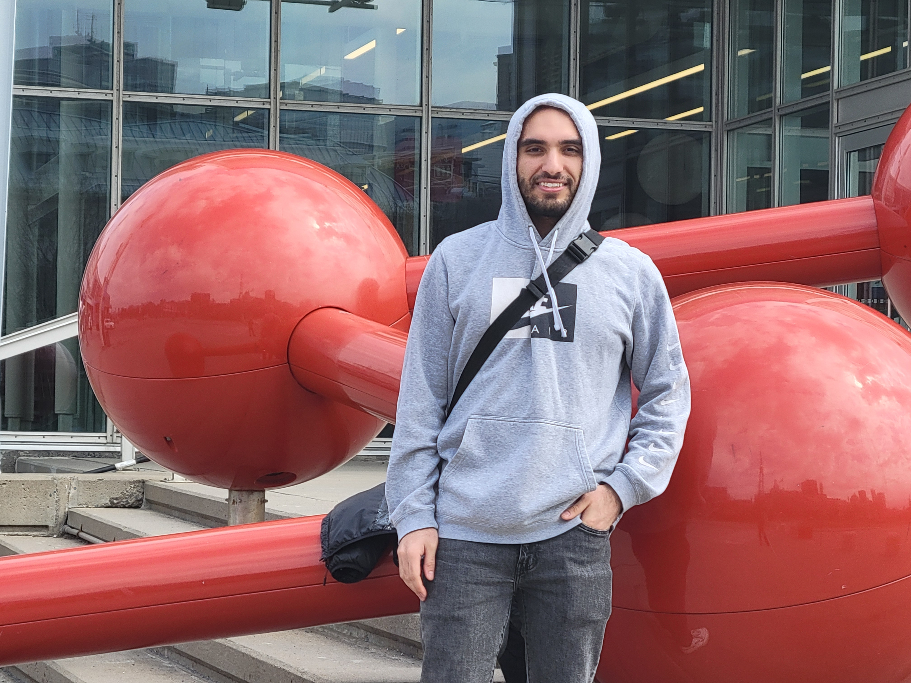
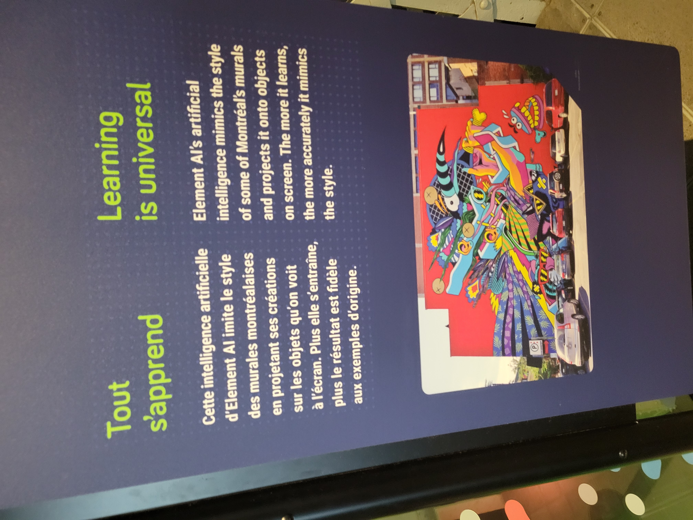
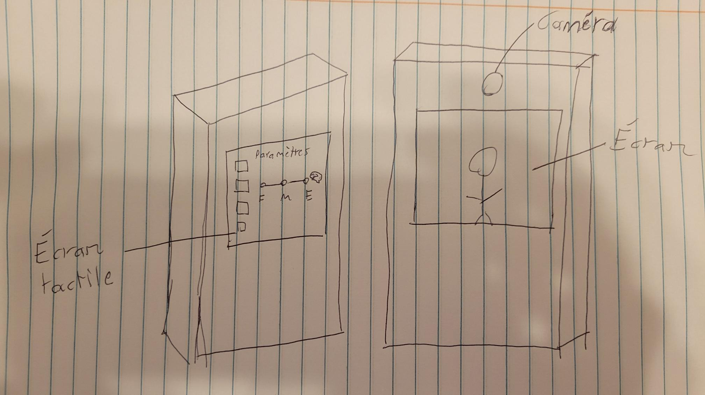
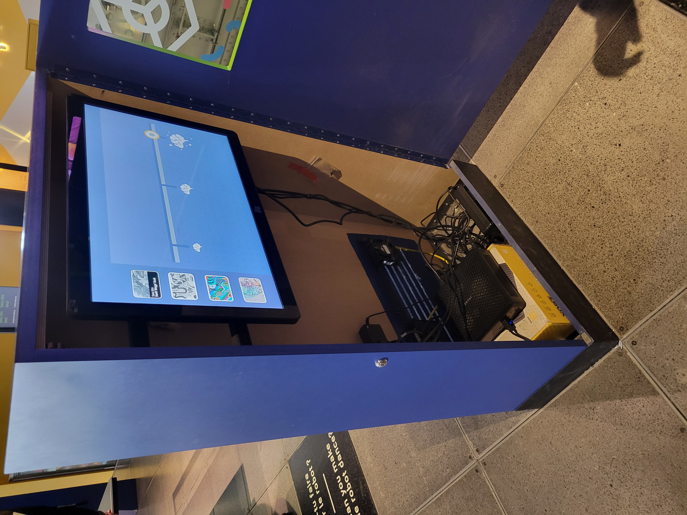
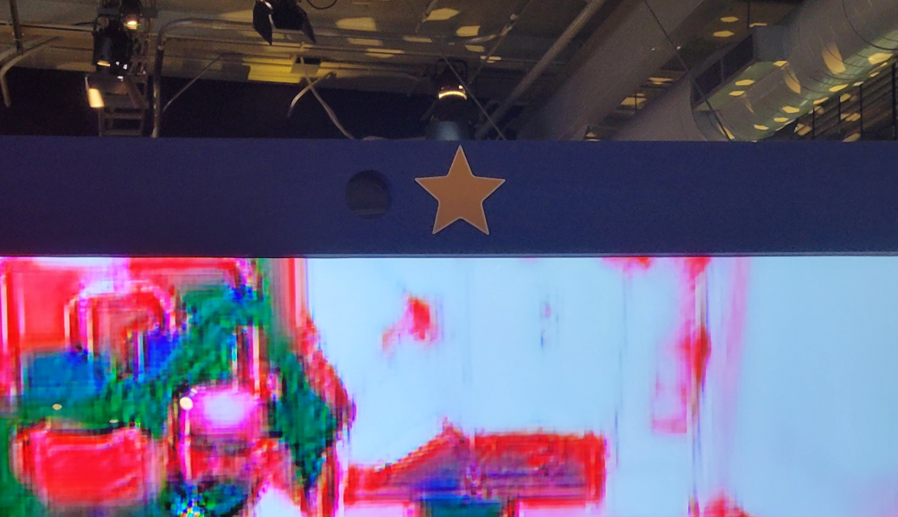
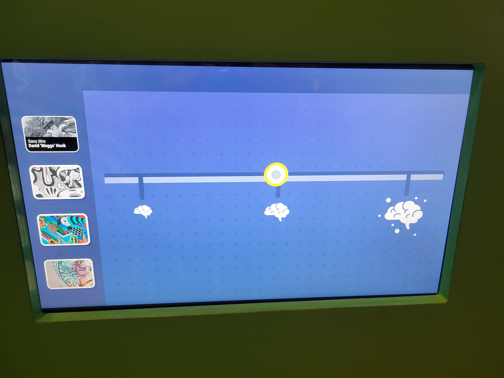
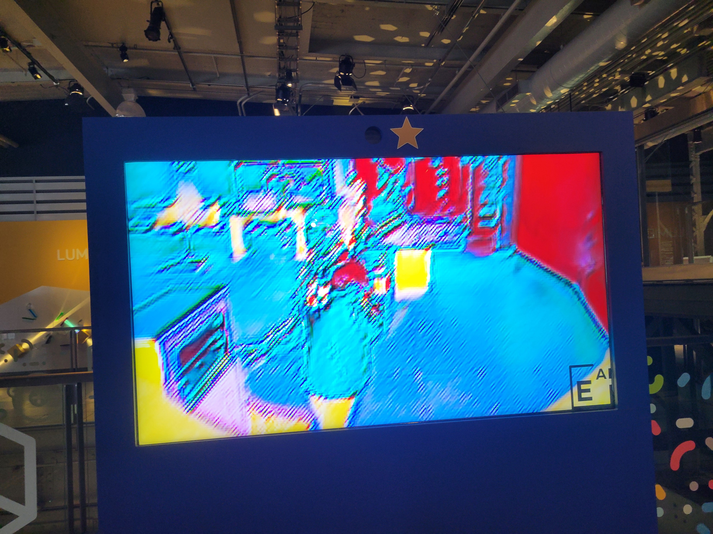
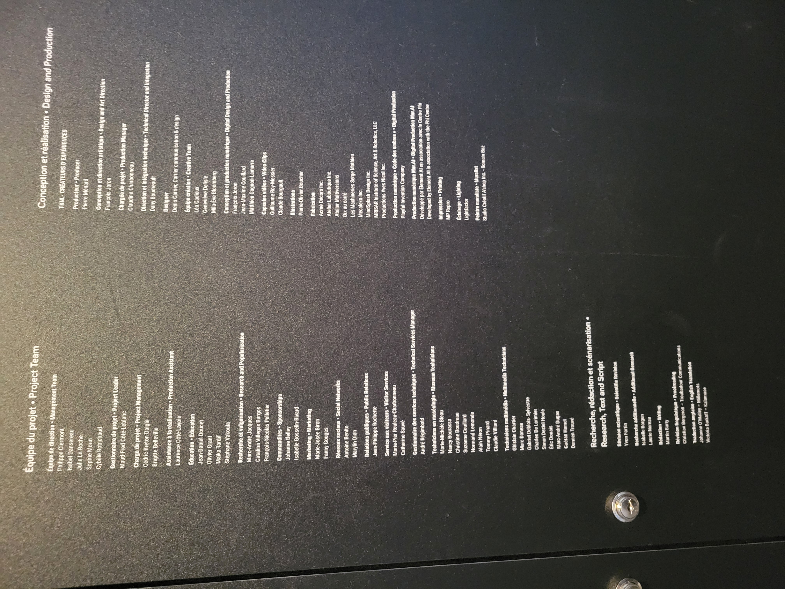
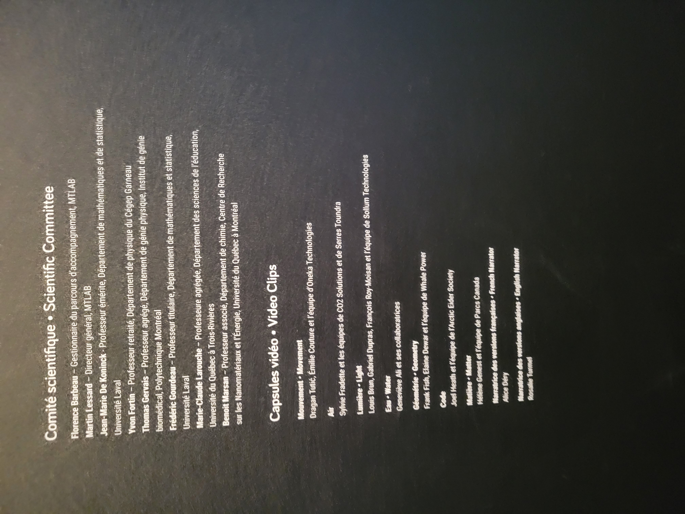
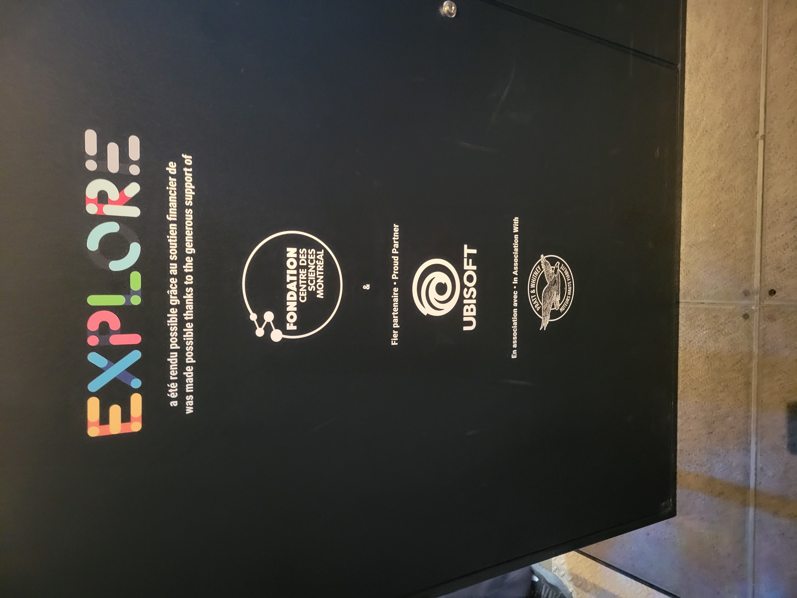

# Tout s'apprend
| **Table des matières** |
|-----------------------|
| [**Description du dispositif**](#description-du-dispositif) |
| [**Type d'installation**](#type-dinstallation-contemplative-immersive-interactive) |
| [**Mise en espace**](#mise-en-espace) |
| [**Composantes et techniques**](#composantes-et-techniques) |
| [**Éléments nécessaires**](#éléments-nécessaires-à-la-mise-en-exposition) |
| [**Expérience vécue**](#expérience-vécue) |
| [**Ce qui vous a plu**](#ce-qui-vous-a-plu-vous-a-donné-des-idées) |
| [**Aspect que vous ne souhaiteriez pas retenir**](#aspect-que-vous-ne-souhaiteriez-pas-retenir-pour-vos-propres-créations-ou-que-vous-feriez-autrement) |
| [**Autres photos**](#autres-photos-de-lexpérience) |
| [**Crédits et partenaires**](#crédits-et-partenaires-de-lexposition-permanente) |
<h3 align="center">Voici ma documentation sur le dispositif "Tout s'apprend" de l'exposition permanente du Centre des sciences de Montréal.</h3>

  
 Photo de moi devant le Centre des sciences de Montréal 

***
### Description du dispositif
C'est un dispositif qui démontre aux visiteurs les capacités de l'intelligence artificielle en transformant ce qu'elle capture avec la caméra dans le même style que les fameuses murales de Montréal.
| Description du dispositif |
| :---: |
|  |
***
### Type d'installation (contemplative, immersive, interactive)
C'est une installation interactive et légèrement immersive où l'utilisateur peut modifier les paramètres de l'expérience, offrant ainsi le choix de changer le style artistique utilisé et le niveau d'intelligence artificielle employé. Le fait que la caméra nous capture et nous projette sous forme d'œuvre d'art accorde un aspect d'immersion à l'expérience.

***

### Mise en espace
Il s'agit de deux grandes boîtes placées l'une à côté de l'autre de manière perpendiculaire. Cependant, la boîte qui contient la partie du dispositif que le visiteur peut contrôler est légèrement plus basse que celle qui est équipée de la caméra. De plus, il y a un trou dans les deux boîtiers pour l'écran.
| Schéma du dispositif |
| :---: |
| |
***
### Composantes et techniques
Le dispositif utilise des écrans, une caméra, des ordinateurs, des câbles d'alimentation et d'extension. Le logiciel que le dispositif(l'oridinateur) utilise fait appel à l'intelligence artificielle.
| Photos des composantes du dispositif. |
| :---: |
|    L'intérieur du dispositif, on peut voir les câbles, l'ordinateur et les autres composantes qui font fonctionner le dispositif.| 
|    On peut remarquer que le deuxième écran est équipé d'une caméra. |
***
### Éléments nécessaires à la mise en exposition
Le dispositif comprend un espace réservé pour que la caméra puisse capturer le visiteur ou l'interacteur. Il s'agit de deux boîtiers, chacun avec un écran (un tactile et l'autre non). Celui qui n'a pas d'écran tactile est équipé d'une caméra. À l'intérieur des boîtiers se trouvent également un ordinateur et les câbles qui les connectent à l'alimentation.
***
### Expérience vécue
C'était une petite expérience rapide et intéressante.
***
### Ce qui vous a plu, vous a donné des idées👍
J'ai aimé le fait que le dispositif est capable d'imiter le style des fameuses murales de Montréal de manière très réaliste.
***
### Aspect que vous ne souhaiteriez pas retenir pour vos propres créations ou que vous feriez autrement👎
Les aspects que je n'ai pas aimés du dispositif sont l'interface utilisateur qui n'est pas très intuitive et la manière dont les éléments sur l'écran tactile sont présentés. Ils auraient dû mettre une phrase en haut du curseur qui dise "Glissez-moi !" et quand vous glissez le curseur avec votre doigt, que le curseur suive votre doigt. De plus, la zone où la caméra peut vous capturer aurait pu être délimitée avec un décalque sur le sol.
***
### Autres photos de l'expérience.
| Photos de l'expérience |
| :---: |
|    Sur cet écran, on peut modifier le style artistique et le niveau d'IA utilisé. Si le cercle est à droite, l'IA utilisée est élevée, et à gauche, le niveau d'utilisation est très faible. Au centre, le niveau est moyen.|
|    Niveau d'IA faible.|
|    Niveau d'IA moyen.| 
|   Niveau d'IA élevée.|

## Crédits et partenaires de l'exposition permanente.

    

