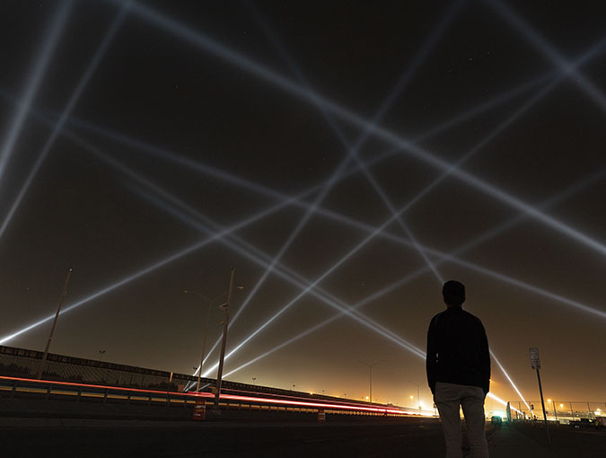

## Conférence du 16 avril présentée par Jade Séguela.

Le 16 avril 2024, une conférence animée par Jade Séguela, registraire pour le studio Antimodulaire, s'est tenue, offrant un aperçu fascinant de son travail et des défis auxquels elle est confrontée au quotidien.

Dans un premier temps, Mme Séguela a présenté son rôle crucial au sein du studio dirigé par l'artiste Rafael Lozano-Hemmer, un artiste mexicano-canadien reconnu à l'internationale. Elle a éclairé les tâches et responsabilités souvent méconnues de sa profession, notamment celles liées à la maintenance, à l'installation, à la documentation et à l'expédition des œuvres d'art.

Au cours de la conférence, deux projets auxquels elle a participé ont été mis en avant pour illustrer son travail remarquable : "Last Breath", une exposition tenue à Sydney, et "Translation Stream", une installation majeure à Abu Dhabi. À travers ces exemples captivants, Jade Séguela a démontré avec éloquence les défis complexes auxquels elle et son équipe sont confrontés, des contraintes environnementales aux défis logistiques, et comment elles ont su les surmonter avec une expertise remarquable.

J'ai bien aimé la conférence. Elle a mis en lumière les diverses tâches et obligations de nature administrative liées à la réalisation des œuvres multimédias. Ce qui est quelque chose que peu de monde savent, car développer une œuvre ne se résume pas uniquement à la créativité, mais nécessite également l'implication de professionnels de diverses spécialités pour permettre sa réalisation.

  Border Tuner / Sintonizador Fronterizo – El Paso, United States connected with Ciudad Juárez, México, 2019
   source: https://www.lozano-hemmer.com/

