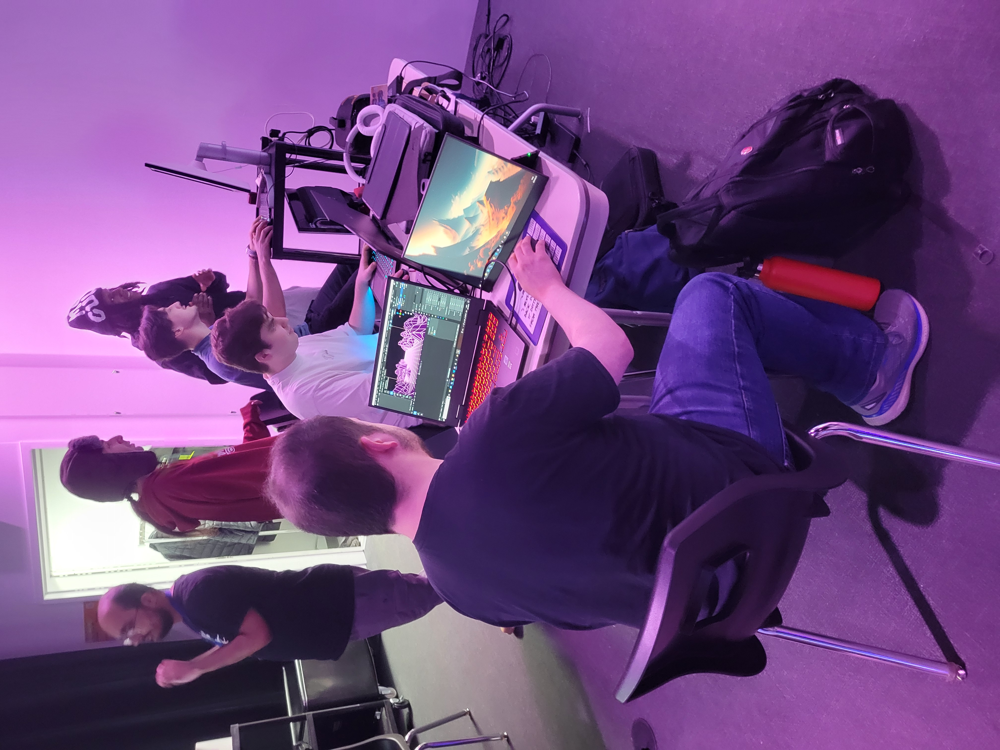
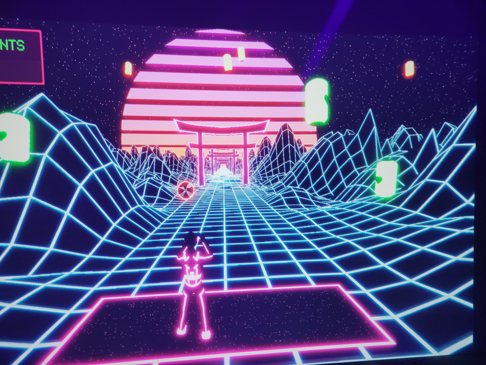

| **Table de matières** |
|-----------------------|
| [**Kigo**](#1kigo)        |
| [**Rhizomatique**](#2rhizomatique) |
| [**Canevas cosmique**](#3canevas-cosmique) |
| [**Sonalux**](#4sonalux) |
| [**Effet-Papillon**](#5effet-papillon) |

# 1.Kigo
## Créateurs:
* Nicolas St-Martin
* Antoine Dion
* Érick Ouellette
* william Rathier Mailly
* Gabriel Clerval

| Cartel du projet |
| :---: |
| |

## Lien du projet avec Crescentia:
Selon moi, le lien entre le projet Kigo et la thématique de l'exposition Crescentia réside dans le fait que c'est un jeu qui évolue en continu : plus vous survivez longtemps dans le jeu, plus le niveau de difficulté augmente. Il y a une croissance dans le niveau de difficulté.
## L'installation en cours:
Le projet Kigo se compose d'un projecteur projetant le jeu sur une toile accrochée au mur, d'une Kinect v2, de haut-parleurs et de lampes UV. L'interacteur se place dans une zone délimitée à l'aide d'un ruban adhésif sur le sol, où seule la Kinect peut le détecter. Le joueur se déplace latéralement pour marquer des points et éviter les obstacles. Pendant le jeu, de la musique accompagne l'expérience, tandis que des sons se déclenchent lorsque le joueur gagne des points ou perd une vie. À la fin du jeu, si le joueur perd toutes ses vies, un tableau des scores s'affiche, montrant son score ainsi que les scores les plus élevés réalisés dans le jeu.
| Photos de l'installation |
| :---: |
|   Les étudiants qui ajustent le jeu.|
|   Un intéracteur qui expérimente le jeu.|
|   La projection du jeu sur la toile.|
## Schéma de l'Installation:
  
  Source: https://github.com/espace-interactif/Kigo/tree/main/docs/preproduction

## 3 Cours Incontournables du Programme:
Les trois cours que je considère comme incontournables pour la réalisation de ce projet sont les cours d'audio 2, de modélisation 3D et d'animation 3D. En effet, le projet implique fortement l'utilisation de sons, la création en 3D et l'animation d'éléments en 3D.
## Technique ou Composante Technologique:
Je ne savais pas qu'il était possible d'intégrer la Kinect dans des projets interactifs. Je pensais que c'était uniquement un accessoire de jeu réservé à la console Xbox.
## Ressenti lors de l'expérience de l'installation:
L'expérience était amusante et m'a rappelé les jeux vidéo qui nécessitaient des mouvements réels, tels que ceux de la console Wii auxquels je jouais lorsque j'étais enfant. Les sons et les images du jeu m'ont immergé dans un univers futuriste, à l'esthétique cyberpunk
## Justification pour Classement de préférence du Projet:
J'ai placé ce projet en première position car je l'ai trouvé simple, très intuitif et facile à comprendre, offrant une expérience immersive. De plus, lors de l'installation de l'exposition, j'ai été impressionné par sa complétude.
***

# 2.Rhizomatique
## Créateurs:
* Jolyanne Desjardins
* Maïka Désy
* Laurie Houde
* Félix Testa Radonovic
## Lien du projet avec Crescentia:
## L'installation en cours:
## Schéma de l'Installation:

Source: https://github.com/TIM-Celestia/Rhizomatique/tree/main/docs/preproduction

## 3 Cours Incontournables du Programme:
## Technique ou Composante Technologique:
## Ressenti lors de l'expérience de l'installation:
## Justification pour Classement de préférence du Projet:

***

# 3.Canevas cosmique
## Créateurs:
* Jacob Alarie-Brousseau 
* Jérémy Cholette 
* Étienne Charron 
* Quoc Huy Do 
* Mikaël Tourangeau

## Lien du projet avec Crescentia:
Le lien de ce projet avec le thème de la croissance réside dans le fait que dans l'interaction du projet, il y a une évolution dépendante des actions apportées par les interacteurs.

## L'installation en cours:

## Schéma de l'Installation:

Source: https://github.com/Les-gars-d-la-table/Canevas-Cosmique/raw/main/docs/preproduction

## 3 Cours Incontournables du Programme:
## Technique ou Composante Technologique:
## Ressenti en Expérimentant les Installations:
## Justification pour Classement de préférence du Projet:

***
# 4.Sonalux
## Créateurs:
* Vincent Desjardins
* Cam/lie Laprise
* Ghita Alaoui
* Antoine Haddad
## Lien du projet avec Crescentia:
## L'installation en cours:
## Schéma de l'Installation:

Source: https://github.com/Sonalux2024/Sonalux/tree/main/docs/preproduction

## 3 Cours Incontournables du Programme:
## Technique ou Composante Technologique:
## Ressenti lors de l'expérience de l'installation:
## Justification pour Classement de préférence du Projet:

***
# 5.Effet-Papillon
## Créateurs:
* Alexis Bolduc
* Raphaël Dumont
* Jasmine Lapierre
* William Morel
* Alexia Papanikolaou
* Viktor Zhuravlev
## Lien du projet avec Crescentia:
## L'installation en cours:
## Schéma de l'Installation:

Source: https://github.com/Iteration6/Effet-Papillon/tree/main/docs/preproduction

## 3 Cours Incontournables du Programme:
## Technique ou Composante Technologique:
## Ressenti lors de l'expérience de l'installation:
## Justification pour Classement de préférence du Projet:

***
