<h1> Crescentia: Projets des élèves finissants </h1>

| **Table de matières** |
|-----------------------|
| [**Kigo**](#1kigo)        |
| [**Rhizomatique**](#2rhizomatique) |
| [**Canevas cosmique**](#3canevas-cosmique) |
| [**Sonalux**](#4sonalux) |
| [**Effet-Papillon**](#5effet-papillon) |

# 1.Kigo
## Créateurs:
* Nicolas St-Martin
* Antoine Dion
* Érick Ouellette
* william Rathier Mailly
* Gabriel Clerval

| Cartel du projet |
| :---: |
| |

## Lien du projet avec Crescentia:
Selon moi, le lien entre le projet Kigo et la thématique de l'exposition Crescentia réside dans le fait que c'est un jeu qui évolue en continu : plus vous survivez longtemps dans le jeu, plus le niveau de difficulté augmente. Il y a une croissance dans le niveau de difficulté.
## L'installation en cours:
Le projet Kigo se compose d'un projecteur projetant le jeu sur le mur, d'une Kinect v2, de haut-parleurs et de lampes UV. L'interacteur se place dans une zone délimitée à l'aide d'un ruban adhésif sur le sol, où seule la Kinect peut le détecter. Le joueur se déplace latéralement pour marquer des points et éviter les obstacles. Pendant le jeu, de la musique accompagne l'expérience, tandis que des sons se déclenchent lorsque le joueur gagne des points ou perd une vie. À la fin du jeu, si le joueur perd toutes ses vies, un tableau des scores s'affiche, montrant son score ainsi que les scores les plus élevés réalisés dans le jeu.
| Photos de l'installation |
| :---: |
|   Les étudiants qui ajustent le jeu.|
|   Un intéracteur qui expérimente le jeu.|
|   La projection du jeu sur le mur.|
## Schéma de l'Installation:
  
  Source: https://github.com/espace-interactif/Kigo/tree/main/docs/preproduction

## 3 Cours Incontournables du Programme:
Les trois cours que je considère comme incontournables pour la réalisation de ce projet sont les cours d'audio 2, de modélisation 3D et d'animation 3D. En effet, le projet implique fortement l'utilisation de sons, la création en 3D et l'animation d'éléments en 3D.
## Technique ou Composante Technologique:
Je ne savais pas qu'il était possible d'intégrer la Kinect dans des projets interactifs. Je pensais que c'était uniquement un accessoire de jeu réservé à la console Xbox.
## Ressenti lors de l'expérience de l'installation:
L'expérience était amusante et m'a rappelé les jeux vidéo qui nécessitaient des mouvements réels, tels que ceux de la console Wii auxquels je jouais lorsque j'étais enfant. Les sons et les images du jeu m'ont immergé dans un univers futuriste, à l'esthétique cyberpunk
## Justification pour Classement de préférence:
J'ai placé ce projet en première position car je l'ai trouvé simple, très intuitif et facile à comprendre, offrant une expérience immersive. De plus, lors de l'installation de l'exposition, j'ai été impressionné par sa complétude.
***

# 2.Rhizomatique
## Créateurs:
* Jolyanne Desjardins
* Maïka Désy
* Laurie Houde
* Félix Testa Radonovic

| Cartel du projet |
| :---: |
| 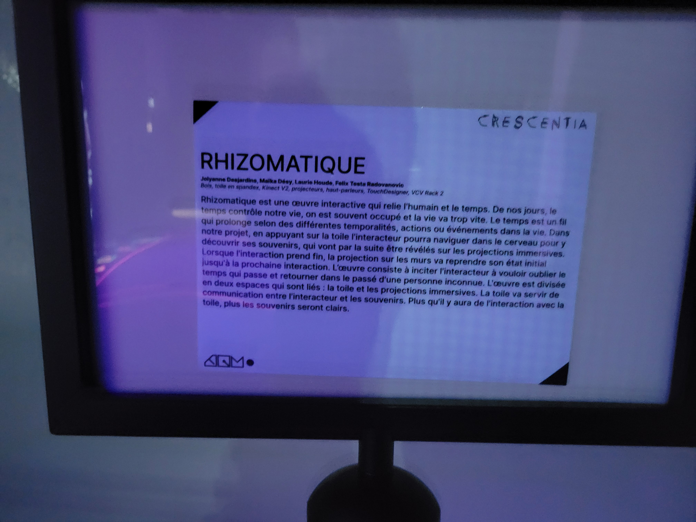|

## Lien du projet avec Crescentia:
Selon moi, le lien entre le projet Rhizomatique et le thème de l'exposition, qui est la croissance, réside dans l'évolution des souvenirs. Selon l'emplacement où l'interacteur place sa main sur la toile, des souvenirs sont affichés, allant des plus anciens aux plus récents, reflétant ainsi un processus de croissance.
## L'installation en cours:
L'expérience Rhizomatique se compose de haut-parleurs, de projecteurs, d'une sorte de boîte munie d'une toile sur sa surface, ainsi que d'une Kinect avec un projecteur en dessous de la boîte. L'interacteur place sa main sur la toile située sur la surface de la boîte, et la Kinect en dessous détecte la position de la main. Lorsque la main est déposée, une silhouette de main s'affiche sur la toile de la boîte, et l'animation sur le mur change pour présenter un souvenir correspondant. De plus, l'expérience est accompagnée d'un son d'ambiance, et lorsque la main est déposée, un effet sonore est déclenché.

| Photos de l'installation |
| :---: |
| 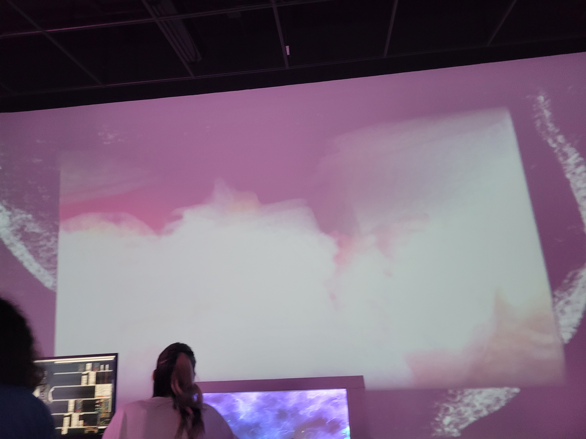  Les étudiants qui ajustent l'expérience.|
| 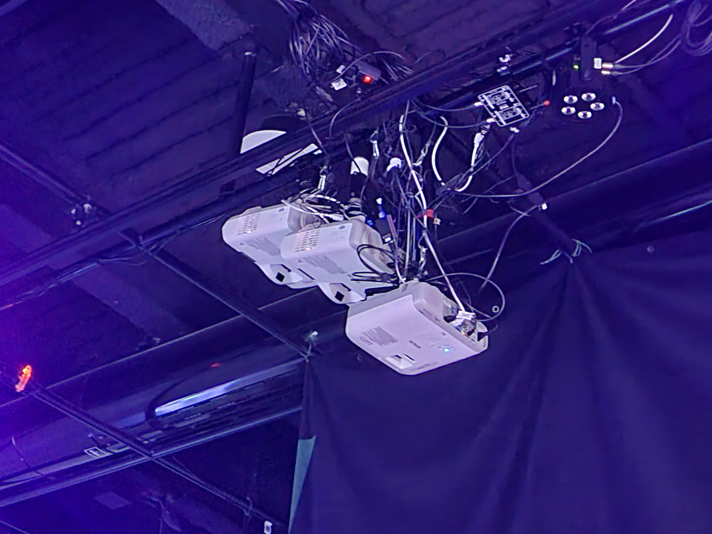  Projecteurs.|
|   La Kinect en dessous de la boîte.|
## Schéma de l'Installation:

Source: https://github.com/TIM-Celestia/Rhizomatique/tree/main/docs/preproduction

## 3 Cours Incontournables du Programme:
Les trois cours que je considère comme incontournables pour la réalisation de ce projet sont ceux de traitement audiovisuel, d'installation multimédia et d'objets interactifs. En effet, le projet implique fortement l'utilisation de projecteurs, d'éléments interactifs, ainsi que des effets en temps réel et le déclenchement des vidéos et échantillons en fonction des interactions.
## Technique ou Composante Technologique:
À travers cette expérience j'ai appris qu'on pouvait utilisé la kinect d'une autre manière que de l'utiliser pour detecter le corps d'une personne et son mouvement, mais pour créer un dispositf interactive avec le projecteur qui rend l'experience très intéressant.
## Ressenti lors de l'expérience de l'installation:
J'ai ressenti une sensation similaire à celle que l'on éprouve en essayant de se rappeler certains moments précieux, mais le temps écoulé les rend flous, rendant difficile de se souvenir de tous les détails exacts.
## Justification pour Classement de préférence:
J'ai placé ce projet en deuxième position parce que j'ai beaucoup aimé le concept, ça me faisait un peu penser à un scrapbook mais en version expérience interactive. L'expérience était simple, mais un peu trop courte.
***

# 3.Canevas cosmique
## Créateurs:
* Jacob Alarie-Brousseau 
* Jérémy Cholette 
* Étienne Charron 
* Quoc Huy Do 
* Mikaël Tourangeau

| Cartel du projet |
| :---: |
| 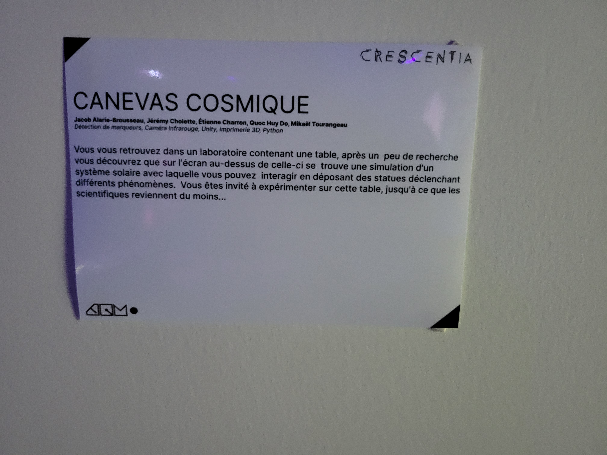|

## Lien du projet avec Crescentia:
Le lien de ce projet avec le thème de la croissance réside dans le fait que dans l'interaction du projet, il y a une évolution dépendante des actions apportées par les interacteurs.

## L'installation en cours:
En termes d'installation, le projet est quelque peu similaire au projet Rhizomatique dans le sens où il utilise des haut-parleurs, des projecteurs et une Kinect. Cependant, au lieu d'une boîte avec la Kinect et un projecteur, il s'agit d'une table qui affiche ce qui est projeté par le projecteur placé en dessous. Sur la table, il y a des statuettes représentant des planètes. Lorsque vous déposez une statuette sur la table, la planète correspondante s'affiche sur le mur. Sous les statuettes, il y a une image similaire à un code QR, mais elle sert à identifier quelle statuette afficher et où l'afficher sur la projection murale en fonction de son positionnement sur la table. L'expérience est accompagnée de sons et d'effets sonores.

| Photos de l'installation |
| :---: |
| 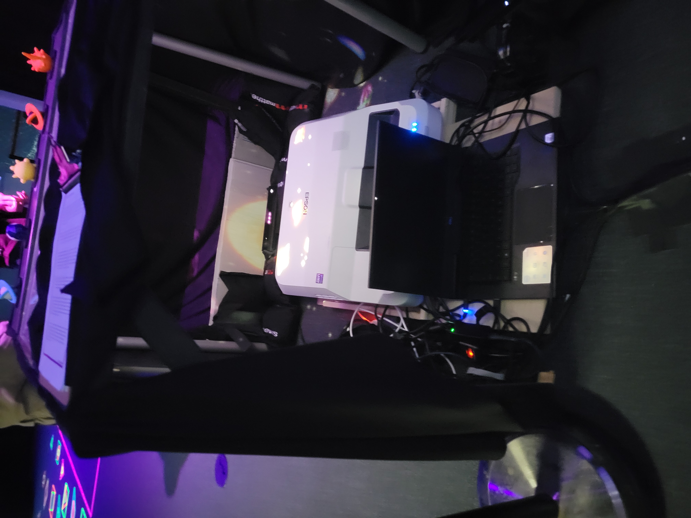  Le projecteur et la Kinect sont positionnés en dessous de la table.|
| 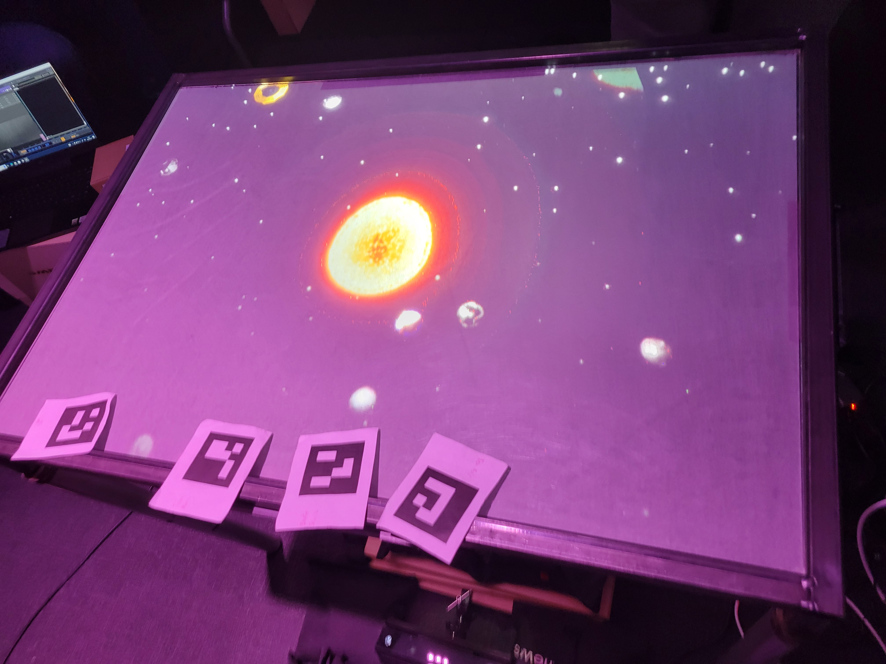  Avant de créer les statues, ils ont testé avec des cartes en papier comportant le code.|
| 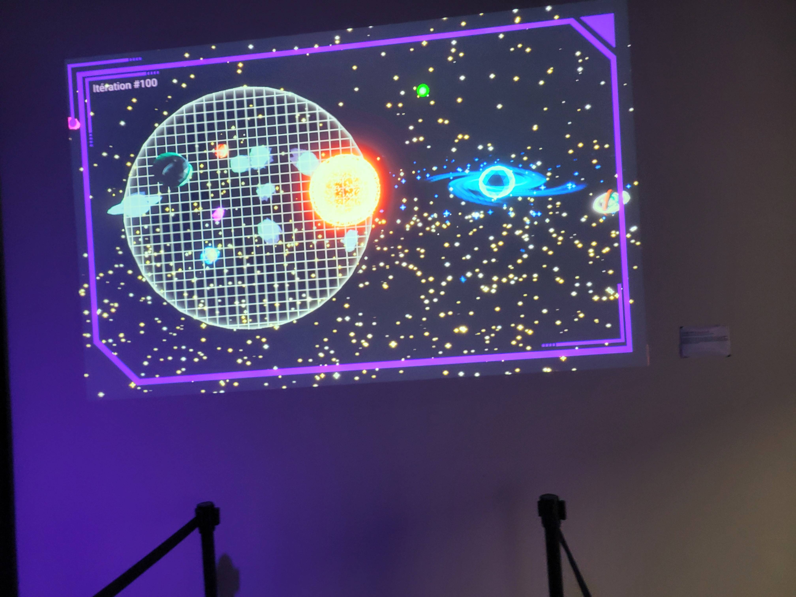  L'expérience projetée sur le mur.|
| 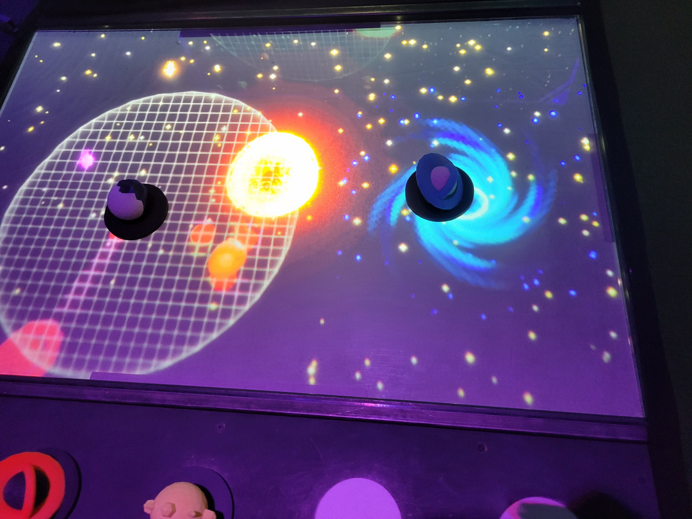  La table et les statuettes. (Pendant l'exposition)|

## Schéma de l'Installation:

Source: https://github.com/Les-gars-d-la-table/Canevas-Cosmique/raw/main/docs/preproduction

## 3 Cours Incontournables du Programme:
Les trois cours que je considère comme incontournables pour la réalisation de ce projet sont les cours d'installation multimédia, de modélisation 3D et d'animation 3D. En effet, le projet implique fortement l'utilisation de la projection vidéo, la création en 3D et l'animation d'éléments en 3D.
## Technique ou Composante Technologique:
L'intégration du langage de programmation Python dans le cadre du projet multimédia. Un script Python a été utilisé pour reconnaître l'image sous les statuettes ainsi que leur positionnement sur la table, puis convertir ces données pour les afficher dans l'expérience projetée sur le mur.
## Ressenti en Expérimentant les Installations:
L'expérience m'a fait ressentir comme si j'étais au Cosmodôme ou dans un autre musée lié à l'astronomie, où il y aurait une expérience interactive similaire. Cela m'a aussi donné un sentiment de contrôle car j'ai pu essayer différentes combinaisons de planètes et de positionnements de statuettes sur la table, et cela affichait toujours un résultat différent.
## Justification pour Classement de préférence:
J'ai placé le projet en troisième position parce que j'ai trouvé que l'expérience était quand même bonne. Cependant, même si c'était assez intuitif, il fallait passer un certain temps à tester chaque combinaison pour comprendre le résultat obtenu par rapport à l'expérience.

***
# 4.Sonalux
## Créateurs:
* Vincent Desjardins
* Camélie Laprise
* Ghita Alaoui
* Antoine Haddad

| Cartel du projet |
| :---: |
| 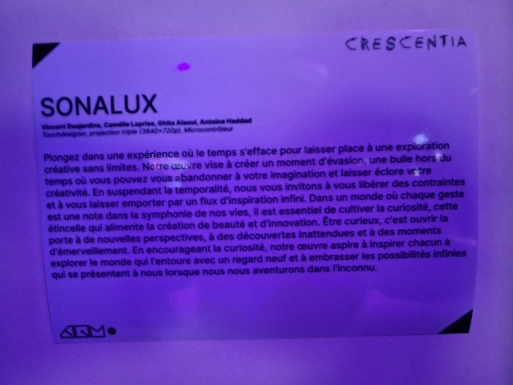|

## Lien du projet avec Crescentia:
Le lien de ce projet avec la thématique de l'exposition réside dans le fait qu'il est toujours en évolution.
## L'installation en cours:
L'expérience utilise trois projecteurs, trois murs (dont deux mobiles), un podium équipé de boutons pour contrôler l'expérience, ainsi que des écouteurs accrochés sur le podium. En fonction des boutons pressés, la projection et la musique changent d'une certaine manière, mais le contenu généré reste toujours différent, ne demeurant jamais le même.

| Photos de l'installation |
| :---: |
| 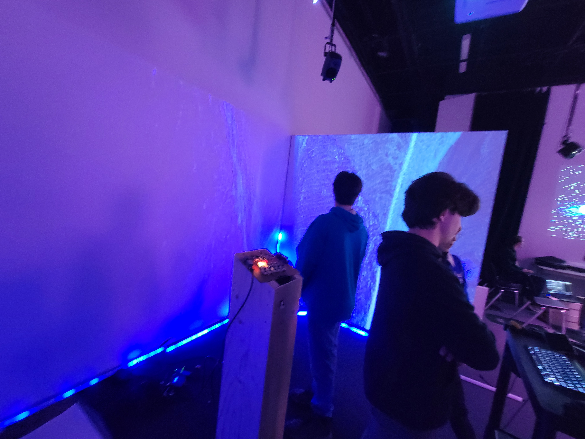  L'expérience Sonalux pendant l'installation.|
| 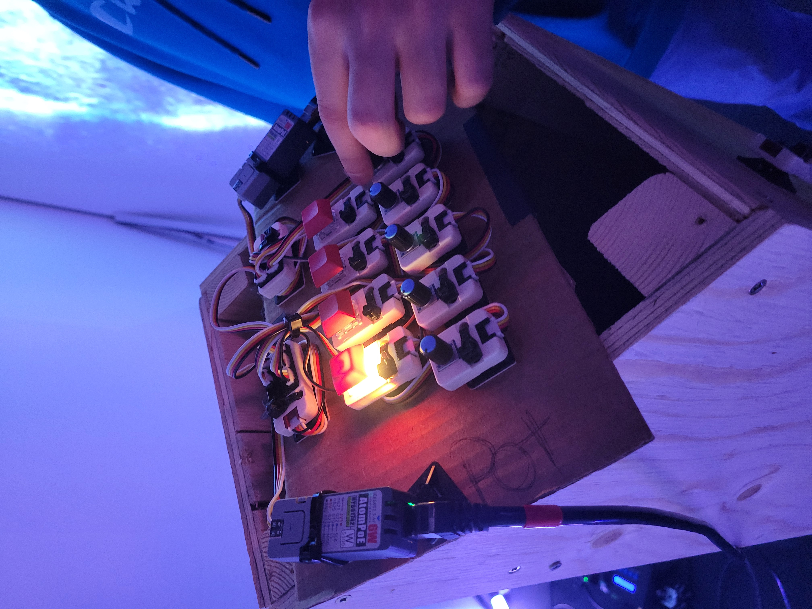  Le prototype du podium pendant l'installation.|
| 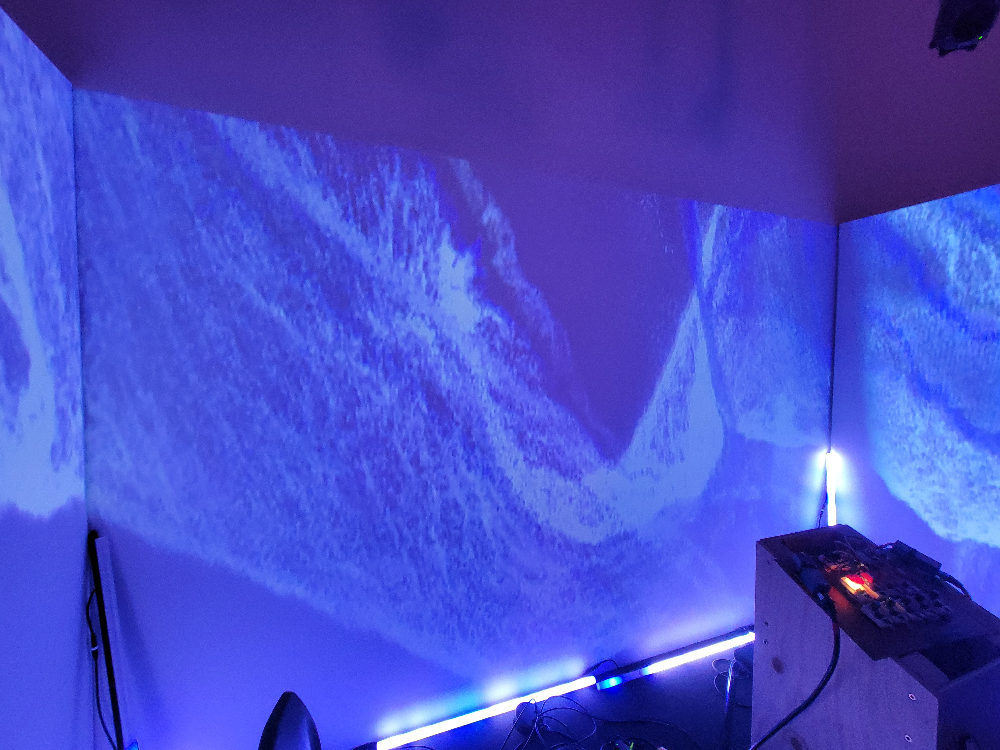  Vue de l'expérience sans intéracteur pendant l'installation.|

## Schéma de l'Installation:

Source: https://github.com/Sonalux2024/Sonalux/tree/main/docs/preproduction

## 3 Cours Incontournables du Programme:
Trois cours incontournables du programme pour la réalisation de ce projet seraient le cours de traitement audiovisuel, le cours d'objets interactifs et le cours d'installation multimédia. En effet, le projet fait fortement usage d'appareils électroniques pour contrôler l'expérience, d'effets spéciaux et de la projection vidéo.
## Technique ou Composante Technologique:
À travers cette expérience, j'ai appris que le logiciel TouchDesigner permet la création d'effets visuels en temps réel et la génération d'art audiovisuel de manière dynamique.
## Ressenti lors de l'expérience de l'installation:
L'expérience m'a donné un sentiment de contrôle similaire à celui de l'expérience du Canevas cosmique. Cependant, le fait que le contenu soit généré de manière aléatoire signifie qu'on ne peut jamais anticiper ce qui va s'afficher ou ce que l'on va entendre, ce qui rend l'expérience un peu monotone. Par ailleurs, en termes de visuels, cela m'a donné l'impression d'être projeté dans le futur, l'expérience semblant être vivante grâce à son évolution indépendante.
## Justification pour Classement de préférence:
J'ai classé l'expérience en quatrième position car les visuels et les sons étaient bons, mais l'expérience était très courte. Bien qu'elle continue sans arrêt à générer du contenu différent à l'infini, après quelques minutes, j'avais envie de passer à autre chose
***

# 5.Effet-Papillon
## Créateurs:
* Alexis Bolduc
* Raphaël Dumont
* Jasmine Lapierre
* William Morel
* Alexia Papanikolaou
* Viktor Zhuravlev

| Cartel du projet |
| :---: |
| 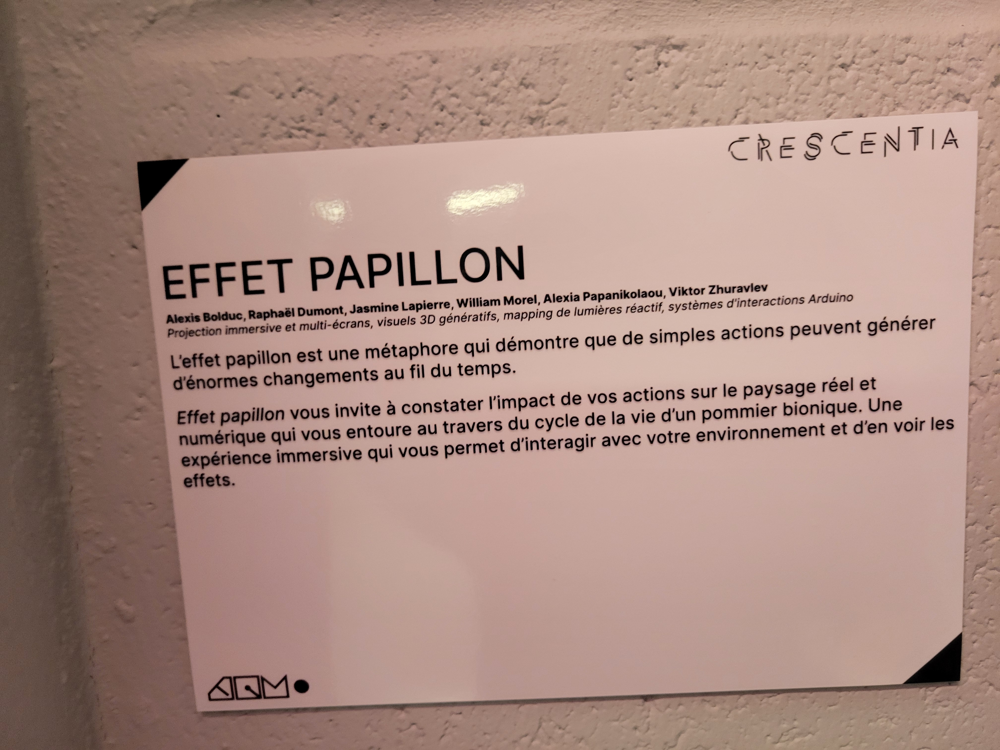|

## Lien du projet avec Crescentia:
Le projet se concentre sur le concept du cycle de la vie, ce qui s'aligne parfaitement avec le thème de l'exposition axé sur la croissance.
## L'installation en cours:
L'installation de l'expérience Effet-papillon est très unique par rapport aux autres projets, car elle utilise une pièce complète (le petit studio) et consiste en 3 projecteurs. Il y a également des haut-parleurs qui diffusent des effets sonores pendant l'expérience. Au centre de la pièce se trouve un tronc supposé représenter un arbre, et à travers les interactions que vous faites, l'arbre grandit. À la fin, il est censé projeter un paysage avec un cerf sur les murs de la pièce, mais ils n'ont pas eu l'occasion de le montrer pendant l'installation de leur projet. De plus, il y a deux leviers et des interrupteurs pour allumer des ampoules suspendues.
| Photos de l'installation |
| :---: |
| 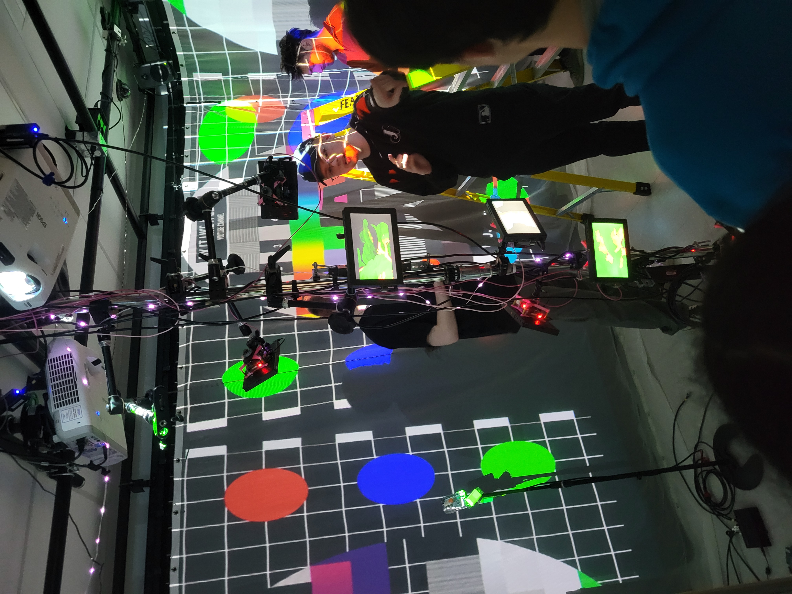  L'expérience Effet-papillon pendant l'installation.|
|   Le modèle 3d pour l'animation du cerf.|
| 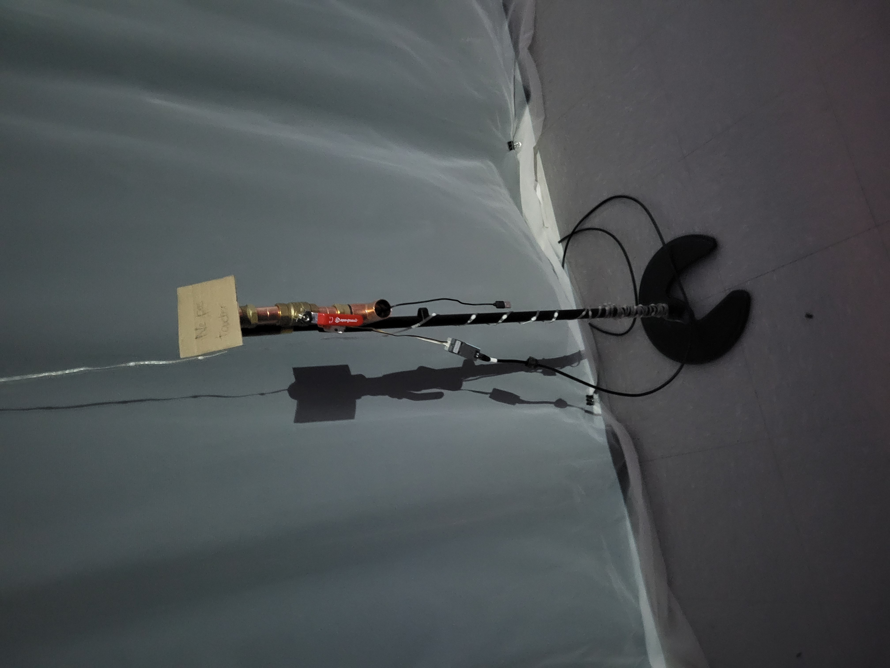  Le prototype du levier pendant l'installation.|
| 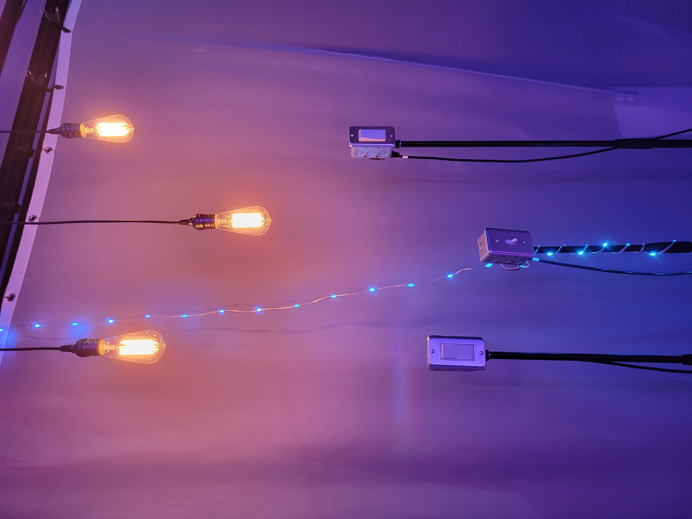  Les interrupteurs avec les ampoules suspendues.|

## Schéma de l'Installation:

Source: https://github.com/Iteration6/Effet-Papillon/tree/main/docs/preproduction

## 3 Cours Incontournables du Programme:
Similaire à l'expérience Sonalux, les trois cours incontournables du programme pour la réalisation de ce projet seraient le cours de traitement audiovisuel, le cours d'objets interactifs et le cours d'installation multimédia. En effet, le projet fait largement appel à l'utilisation d'appareils électroniques pour contrôler l'expérience, aux effets spéciaux et à la projection vidéo.
## Technique ou Composante Technologique:
À travers cette expérience, j'ai découvert les multiples possibilités offertes par les Raspberry Pi dans le cadre de projets multimédias.
## Ressenti lors de l'expérience de l'installation:
L'expérience m'a donné l'impression d'être transporté dans la nature grâce aux effets sonores, mais le projet n'était pas assez complet pour permettre une immersion totale dans l'expérience, malheureusement.
## Justification pour Classement de préférence:
J'ai classé cette expérience en dernière position bien que j'aie beaucoup apprécié leur concept. Cependant, ils ont essayé d'en faire trop pour rendre l'expérience immersive, ce qui n'a pas aidé leur projet et rendait l'expérience peu intuitive.
***
# Vidéos
| Cliquez sur l'image pour voir la vidéo. |
| :---: |
| <a href="https://youtu.be/EsXMM7X0t-A" target="_blank">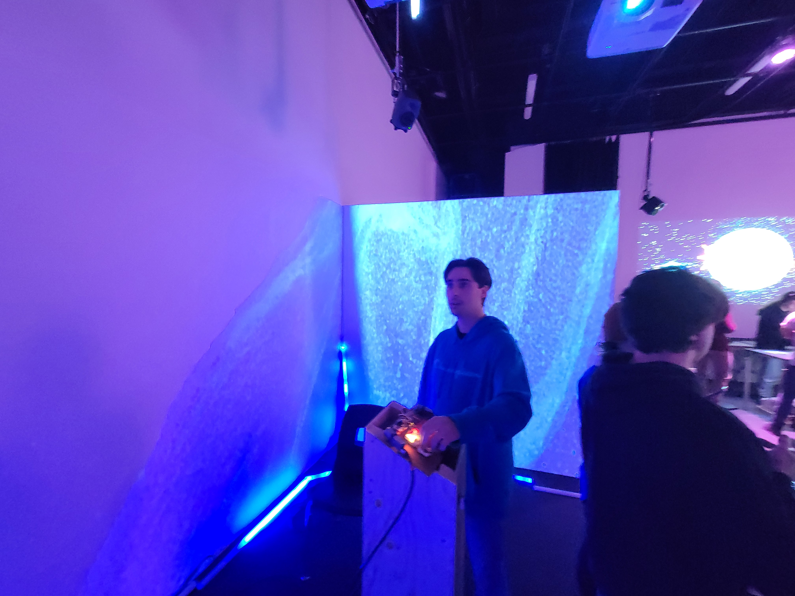</a>  Sonalux |
| <a href="https://youtu.be/SU-UHbMCyRY" target="_blank">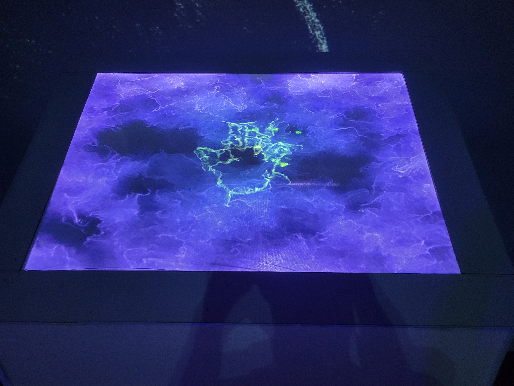</a>  Rhizomatique |
|   Effet-papillon |
***
