# Jeremy Shaw : Phase Shifting Index

Voici mon expérience documentée de ma visite de l'exposition "Phase Shifting Index" créée par Jeremy Shaw le 31 janvier 2024 à La Fonderie Darling.
| Dépliant de l'exposition | Photo de moi devant la Fonderie Darling |
| :---: | :---: |
| 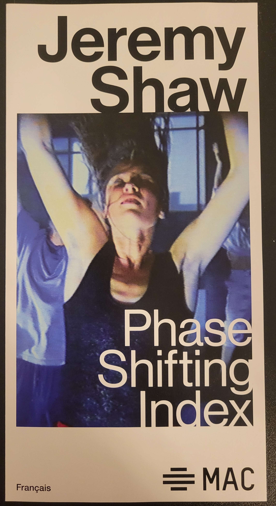 | 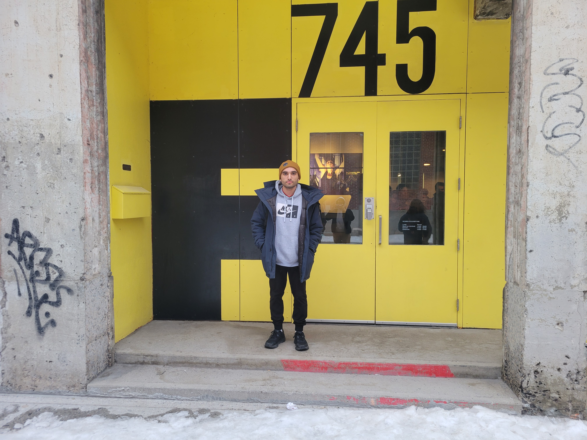|
***
### Description de l'oeuvre🖼️
L'exposition "Phase Shifting Index" se tient actuellement à La Fonderie Darling. Cette exposition temporaire, intérieure et itinérante, présente l'œuvre réalisée en 2020. Selon le cartel, il s'agit d'une installation vidéographique immersive à sept canaux, mêlant couleurs et noir-et-blanc, accompagnée d'un son multi-canaux et de jeux de lumière, d'une durée de 35 minutes et 17 secondes. L'œuvre plonge les spectateurs dans un récit captivant qui explore sept groupes provenant d'un futur lointain, engagés dans un mouvement cherchant à atteindre un état de transe. Elle met en lumière les pratiques et les exercices qu'ils entreprennent pour y parvenir.

| Description de l'oeuvre | Cartel de l'oeuvre |
| :---: | :---: |
| 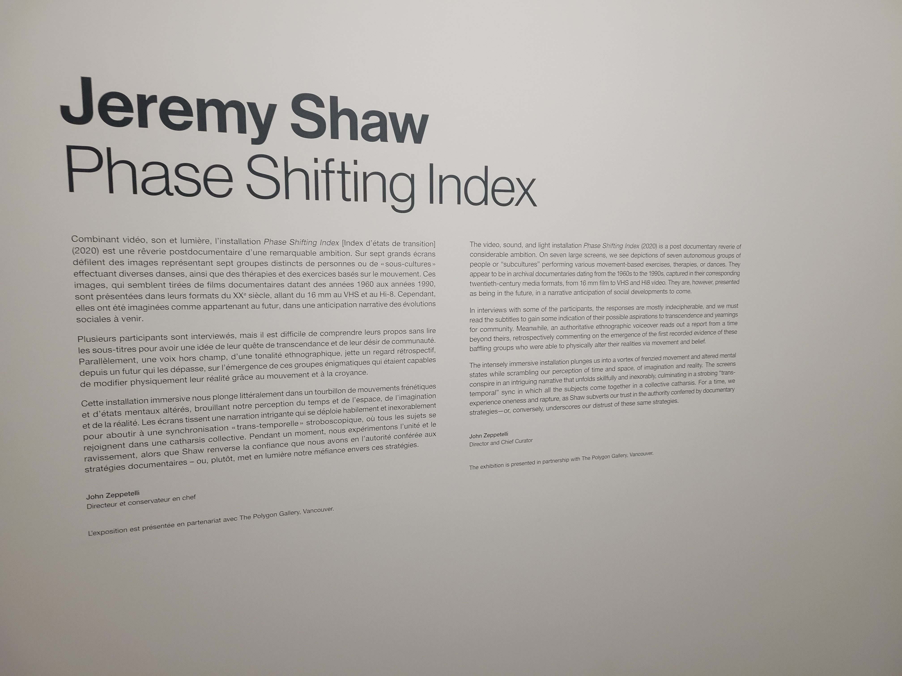 | 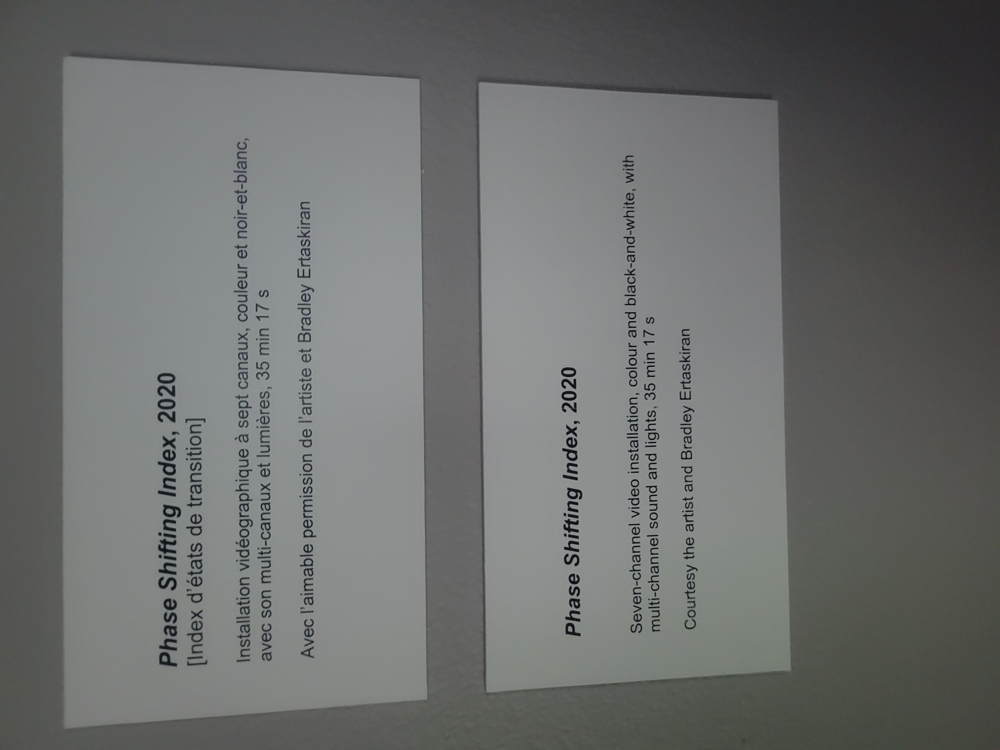|
***
### Type d'installation (contemplative, immersive, interactive)
L'expérience était contemplative et immersive. Les vidéos transportaient les visiteurs dans un monde relaxant et captivant grâce à la musique et aux visuels. Le tapis faisait également partie intégrante de l'œuvre, ajoutant une dimension tactile à l'immersion.

  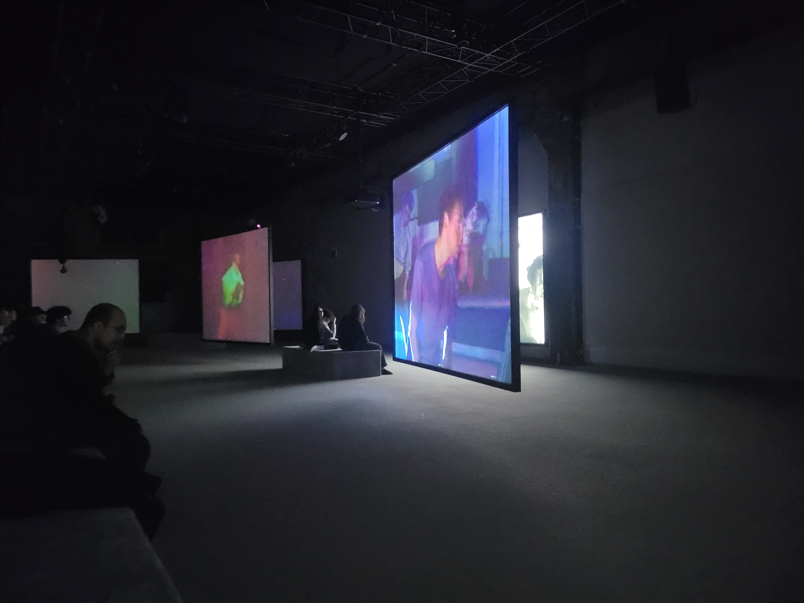

***

### Mise en espace
Il y a 7 écrans au total, avec 5 situés au fond de la pièce et deux au milieu. Chaque écran, à l'exception du projecteur, est associé à deux haut-parleurs. De plus, la pièce est équipée de deux bancs au centre et de deux grands bancs à l'avant. La pièce est également entièrement recouverte d'un tapis choisi par l'artiste. En outre, on trouve deux caissons de basse, un à droite et un à gauche, au fond de la pièce.
| Croquis pièce complète | Croquis expérience |
| :-------------: | :-------------: |
| 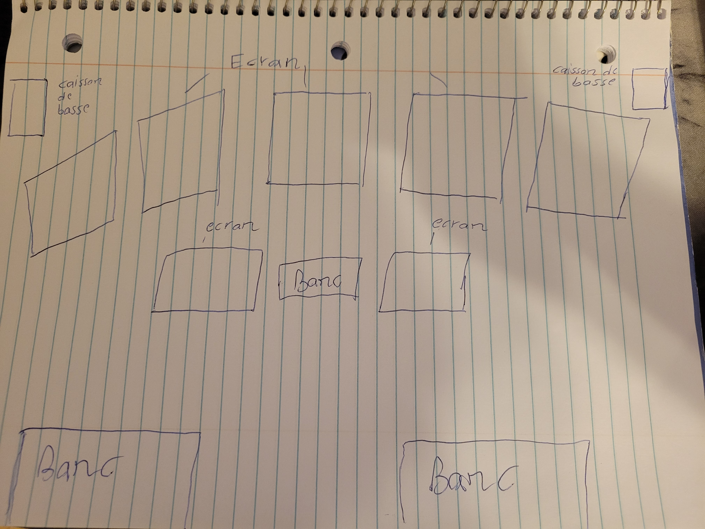 | |

***
### Composantes et techniques
L'œuvre utilise des projecteurs, des écrans, des haut-parleurs, des caissons de basse et un tapis.
| Caisson de basse | L'écran, le projecteur, les haut-parleurs et le tapis |
| :---: | :---: |
| 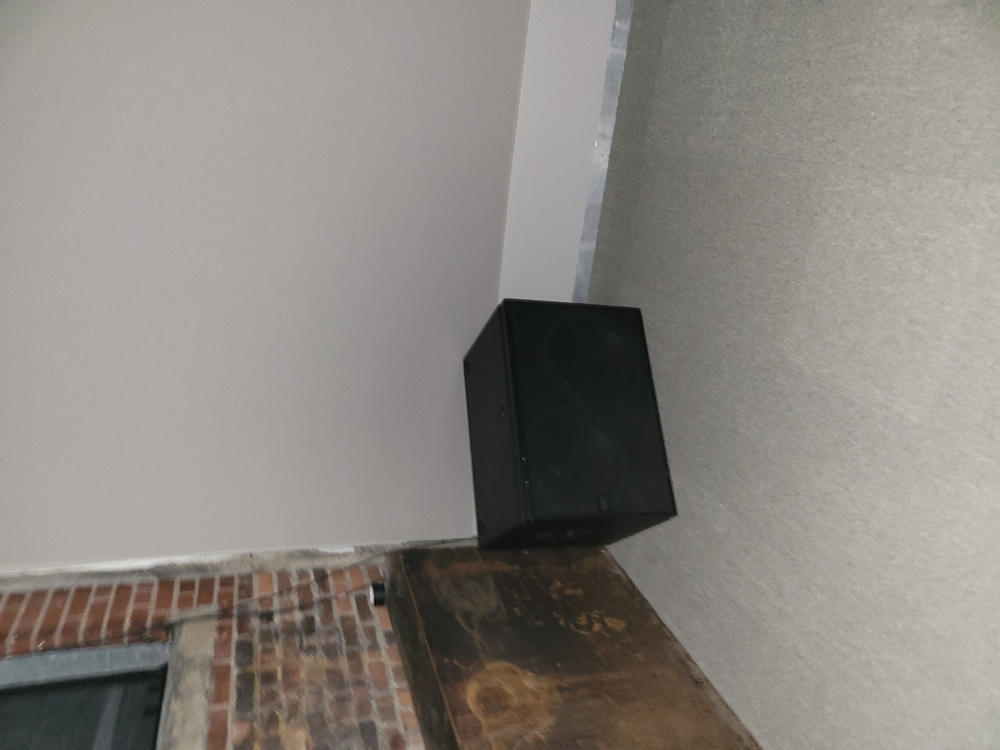 | |

***
### Éléments nécessaires à la mise en exposition

  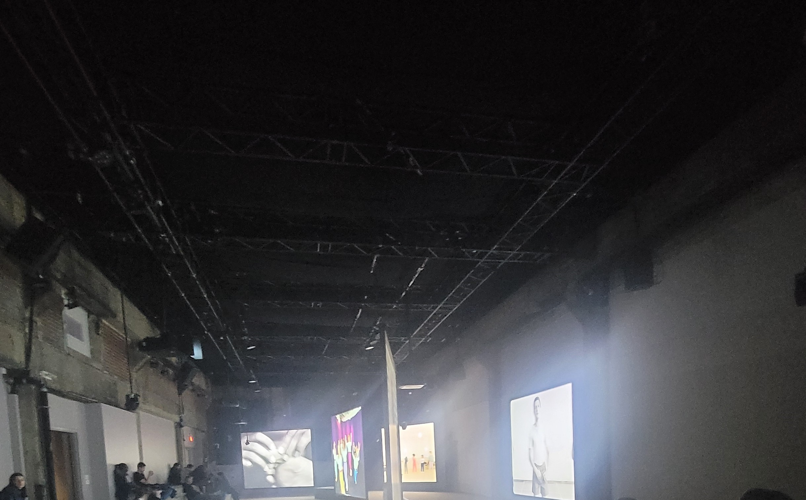

L'exposition nécessitait l'utilisation d'un truss pour suspendre les écrans, les projecteurs et les haut-parleurs. De plus, des bancs étaient également nécessaires pour l'exposition, ainsi que des couvre-chaussures pour ceux qui ne souhaitaient pas enlever leurs chaussures.

***
### Expérience vécue
C'était une expérience détendue où les visiteurs étaient libres de regarder, se promener ou s'asseoir selon leur préférence. Les visiteurs pouvaient regarder l'écran debout ou observer confortablement depuis un banc.
| Vue de l'expérience 1 | Vue de l'expérience 2 |
| :---: | :---: |
| 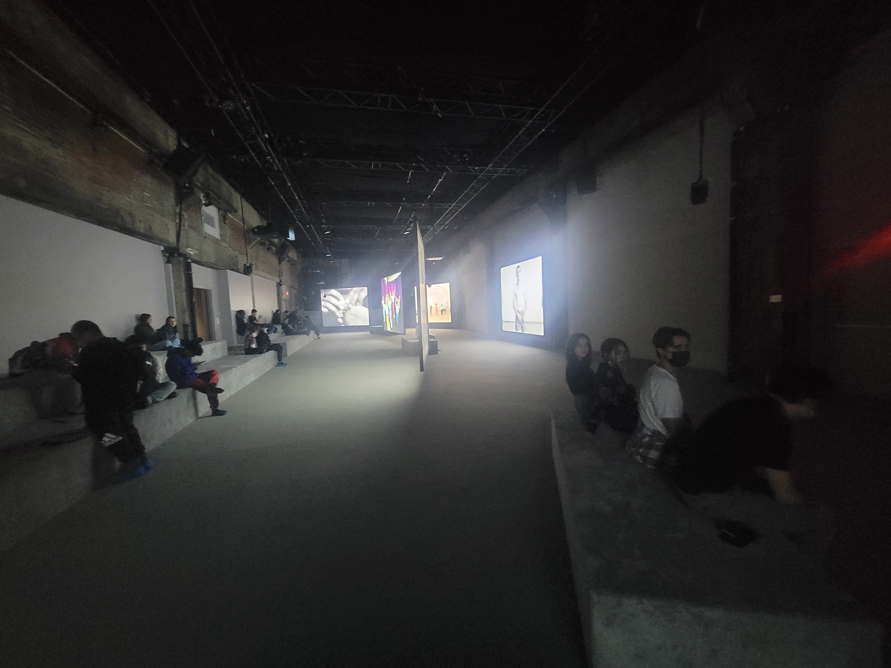 | 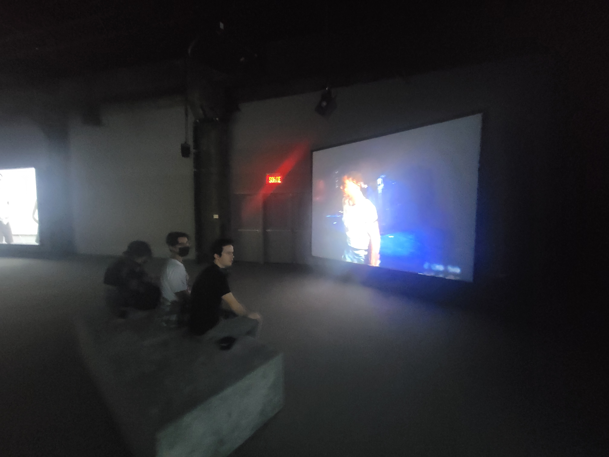|

https://github.com/Rad8433/H24_V11_inspirations_KORDAN/assets/143246722/ddfc9a42-cd7c-41e5-951c-3d64fa211dcd

***
### Ce qui vous a plu, vous a donné des idées👍
J'ai aimé la manière dont les vidéos projetées étaient filmées avec de vieux appareils d'enregistrement, ce qui leur conférait une qualité similaire à celle des films ou séries télévisées des années 70-80. Par ailleurs, j'ai apprécié la synchronisation de l'expérience lorsque différents groupes de personnes exécutant la même danse et musique ont été projetés sur les écrans, ainsi que lorsqu'il y a eu le datamoshing.

| Vue écran 1 | Vue écran 2 |
| :---: | :---: |
|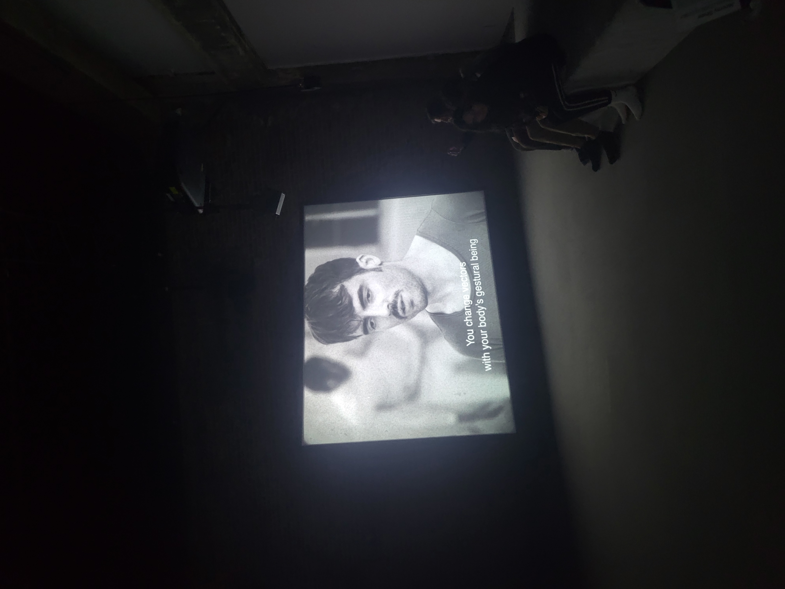 | 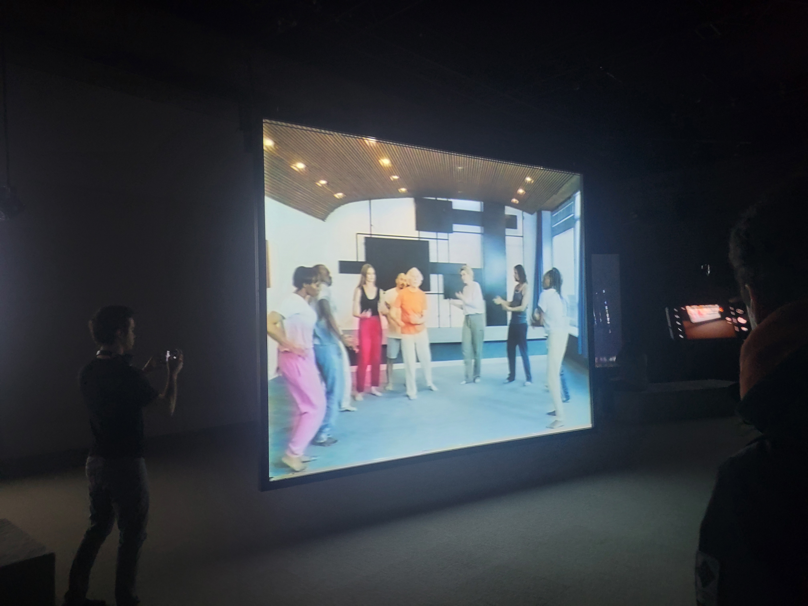|

***
### Aspect que vous ne souhaiteriez pas retenir pour vos propres créations ou que vous feriez autrement👎
Je n'ai pas aimé l'expérience de la danse synchronisée sur les écrans en raison des flashs, ce qui était trop agressif pour les yeux. De plus, j'ai trouvé que l'expérience était un peu trop longue pour ce qu'elle proposait, car elle se répétait simplement à la fin.

***
### Autres photo de l'expérience
|  Effet stroboscope | Vue de côté de la pièce |
| :---: | :---: |
|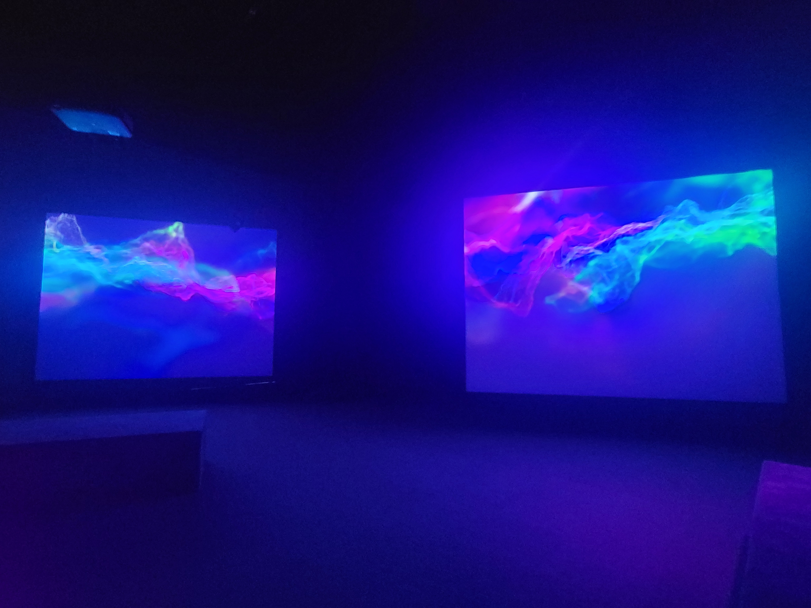 | 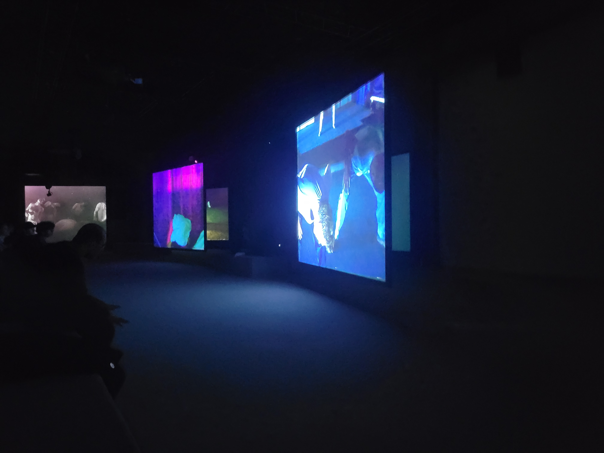 |
| Vue expérience 3 | DataMoshing |
| 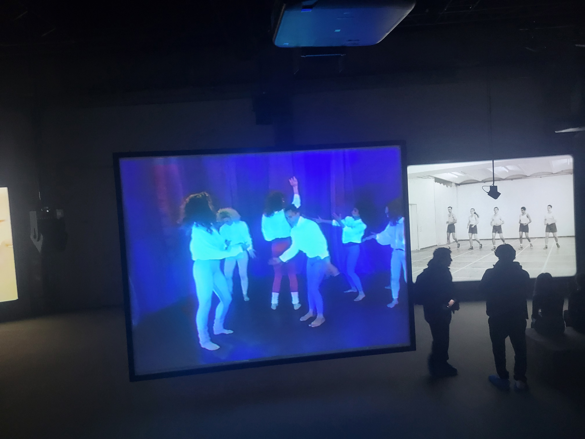 | 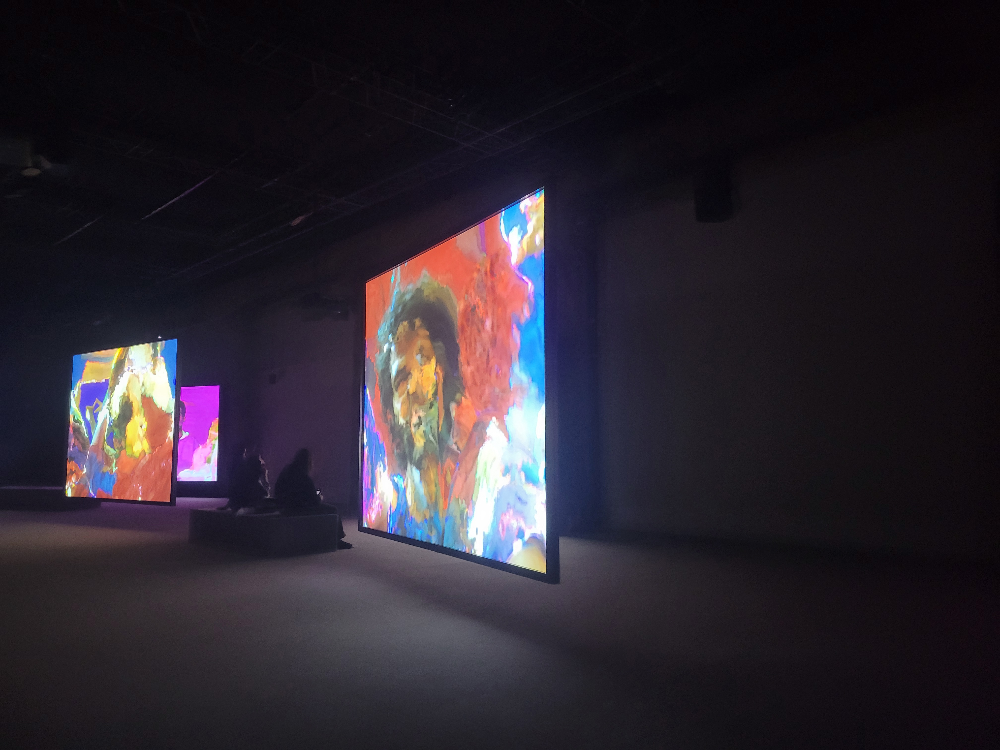 |
