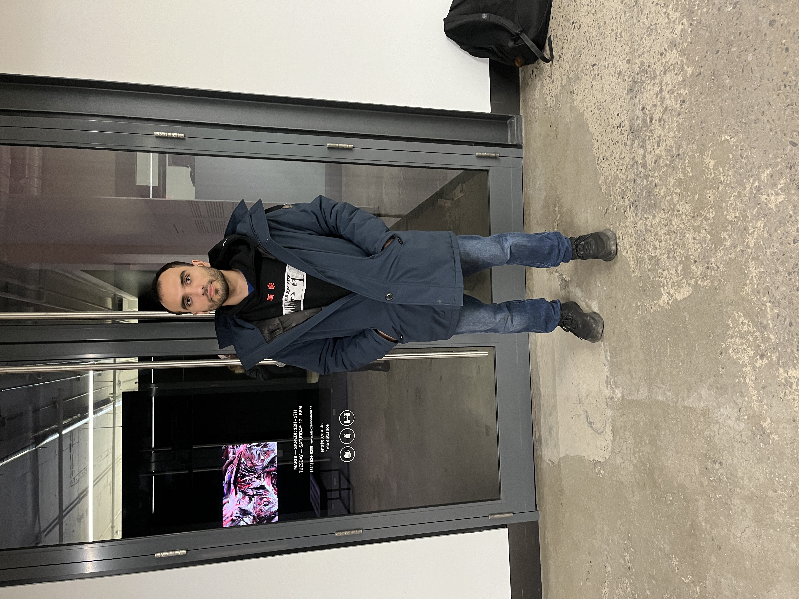
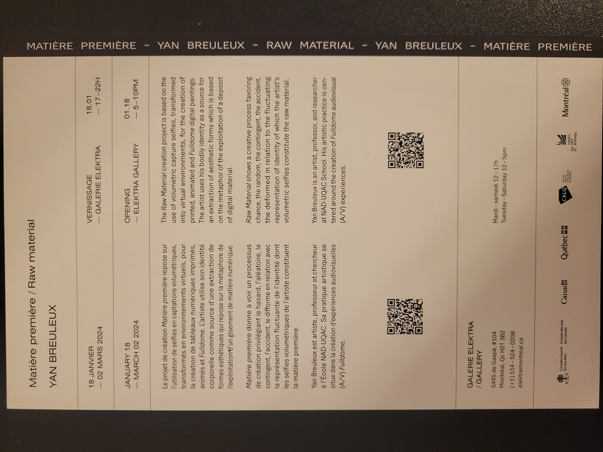
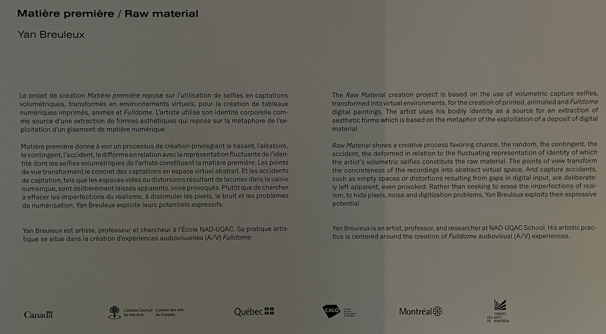
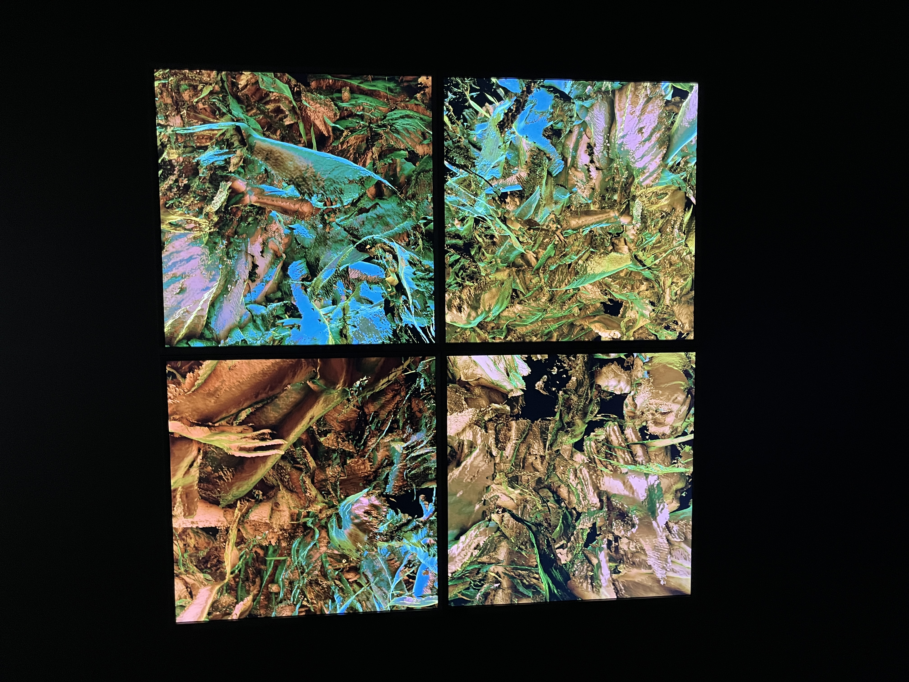

# Yan Breleux : Matière première
Voici mon expérience documentée de ma visite de l'exposition "Matière première" créée par Yan Breleux le 2 mars 2024 à la Galerie Elektra.

  
 Photo de moi devant la galerie Elektra 

| Dépliant de l'exposition | Description derrière le dépliant |
| :---: | :---: |
|  |  |
***
### Description de l'oeuvre🖼️
L'exposition "Matière première" se tient actuellement à la Galerie Elektra. Cette exposition temporaire, intérieure et itinérante, présente l'œuvre réalisée en 2023. Selon la description affichée sur le mur, il est mentionné que c'est une exposition inspirée d'un projet précédent appelé Fulldome, qui consistait à projeter des formes dans un dôme. Cette exposition reprend l'idée des formes et les affiche sur des écrans. L'artiste utilise des images de lui même pour créer les formes qui apparaissent dans son œuvre. Celle-ci ne se limite pas uniquement à des formes affichées, mais elle évolue en changement de positionnement, de couleur et se transforme. L'artiste exploite les imperfections de la numérisation au lieu de les dissimuler.

  
 Description de l'oeuvre 

***
### Type d'installation (contemplative, immersive, interactive)
L'expérience était contemplative et met en lumière la capacité de l'art à susciter des réflexions et des associations qui dépassent la simple observation de ses aspects techniques. Lors de ma visite, avant de savoir que les formes étaient créées avec des selfies numérisés de l'artiste, je pensais que c'étaient des formes inspirées des plantes ou de la végétation.

  

***

### Mise en espace
Lorem ipsum dolor sit amet, consectetur adipiscing elit. Morbi a lacus vitae magna ultricies euismod. Donec tristique accumsan dui nec tincidunt. Sed malesuada augue eu sem cursus, nec aliquam nunc semper. Praesent finibus ultrices justo, sit amet iaculis massa vestibulum at. 
| Croquis pièce complète | Croquis expérience |
| :-------------: | :-------------: |
| image | image |

***
### Composantes et techniques
L'œuvre utilise simplement des écrans.
| Écran | ? |
| :---: | :---: |
| image | image |

***
### Éléments nécessaires à la mise en exposition

  image

Lorem ipsum dolor sit amet, consectetur adipiscing elit. Morbi a lacus vitae magna ultricies euismod. Donec tristique accumsan dui nec tincidunt. Sed malesuada augue eu sem cursus, nec aliquam nunc semper. Praesent finibus ultrices justo, sit amet iaculis massa vestibulum at. 

***
### Expérience vécue
Lorem ipsum dolor sit amet, consectetur adipiscing elit. Morbi a lacus vitae magna ultricies euismod. Donec tristique accumsan dui nec tincidunt. Sed malesuada augue eu sem cursus, nec aliquam nunc semper. Praesent finibus ultrices justo, sit amet iaculis massa vestibulum at. 
| Vue de l'expérience 1 | Vue de l'expérience 2 |
| :---: | :---: |
| image | image |

| Vidéo de l'expérience |
| :---: |
| [image](https://www.youtube.com/) Cliquez sur l'image pour accéder à la vidéo YouTube.|

***
### Ce qui vous a plu, vous a donné des idées👍
J'ai beaucoup apprécié cette exposition pour sa simplicité. C'était une expérience qui nécessitait simplement vos yeux et votre cerveau, et j'ai trouvé intéressant comment l'œuvre pouvait facilement susciter la réflexion.

| Vue écran 1 | Vue écran 2 |
| :---: | :---: |
| image | image|

***
### Aspect que vous ne souhaiteriez pas retenir pour vos propres créations ou que vous feriez autrement👎
Malheureusement, j'ai trouvé que l'expérience était assez courte, car elle se composait de quelques écrans dans une petite pièce. Il était facile de faire le tour en moins d'une demi-heure.

***
### Autres photo de l'expérience
|  ? | ? |
| :---: | :---: |
| image | image |
| ? | ? |
| image | image |
