# Yan Breleux : Matière première
Voici mon expérience documentée de ma visite de l'exposition "Matière première" créée par Yan Breleux le 2 mars 2024 à la Galerie Elektra.

  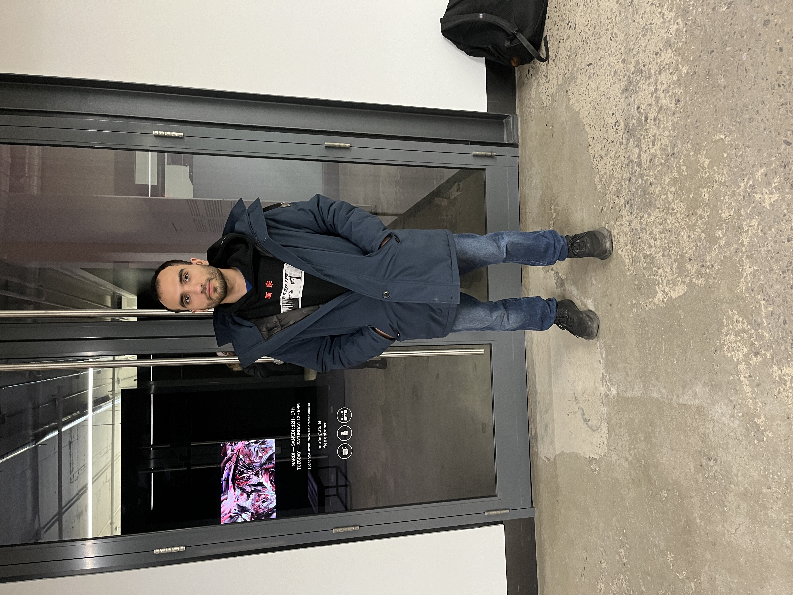
 Photo de moi devant la galerie Elektra 

| Dépliant de l'exposition | Description derrière le dépliant |
| :---: | :---: |
|  |  |
***
### Description de l'oeuvre🖼️
L'exposition "Matière première" se tient actuellement à la Galerie Elektra. Cette exposition temporaire, intérieure et itinérante, présente des œuvres réalisées en 2023. D'après les informations fournies par le coordinateur de la galerie, cette exposition s'inspire de projets antérieurs impliquant la projection de formes dans un dôme. Elle réinterprète cette idée en affichant les formes sur des écrans. L'artiste utilise des images de lui-même pour créer les formes qui apparaissent dans son œuvre. Celle-ci ne se limite pas à des formes statiques, mais évolue dans le temps en variant son positionnement et sa couleur. L'artiste exploite les imperfections de la numérisation au lieu de les dissimuler.

  
 Description de l'oeuvre 

***
### Type d'installation (contemplative, immersive, interactive)
L'expérience était contemplative et met en lumière la capacité de l'art à susciter des réflexions et des associations qui dépassent la simple observation de ses aspects techniques. Lors de ma visite, avant de savoir que les formes étaient créées avec des selfies numérisés de l'artiste, je pensais que c'étaient des formes inspirées des plantes ou de la végétation.

  

***

### Mise en espace
Il y avait 4 écrans carrés collés sur le mur de gauche, formant comme un cadre, et à côté, 3 longs écrans collés placés verticalement. Sur le mur du fond, un écran était placé horizontalement, tandis que sur le mur de droite, un écran était placé verticalement, tout comme ceux de gauche. Près du mur de gauche se trouvaient deux bancs pour s'asseoir.

  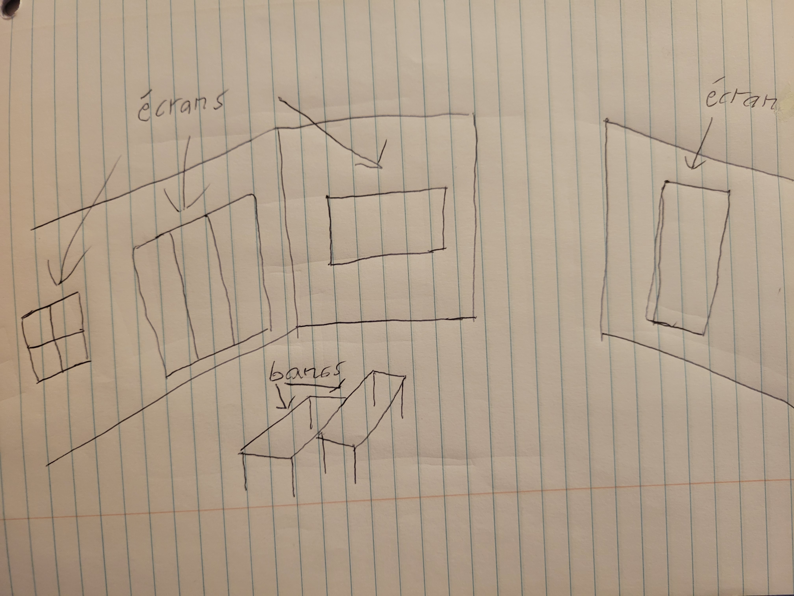
   Croquis de l'expérience 

| Vue gauche de la piece | Vue droite de la pièce |
| :---: | :---: |
| 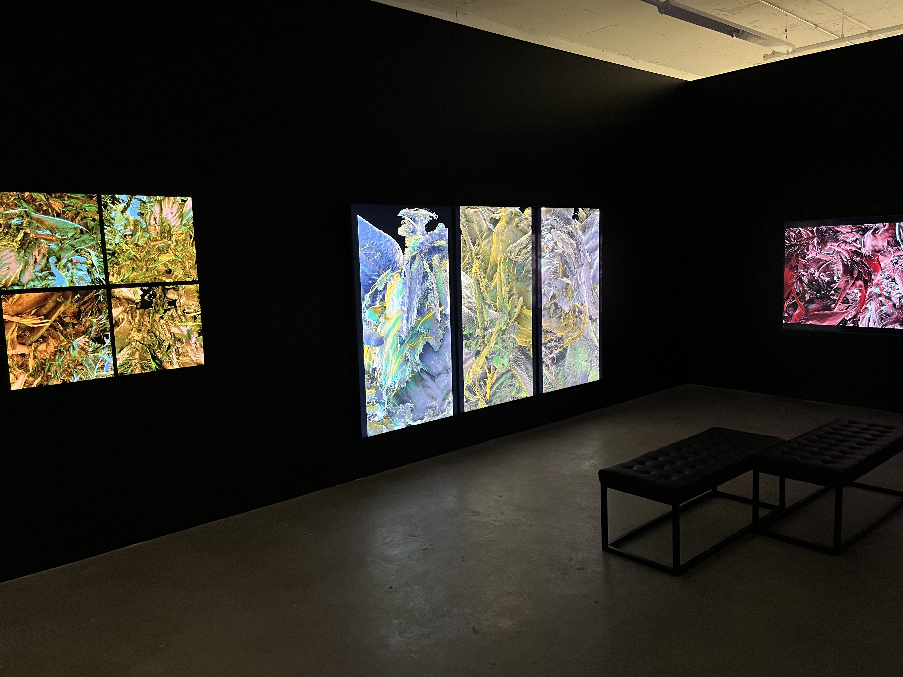 | 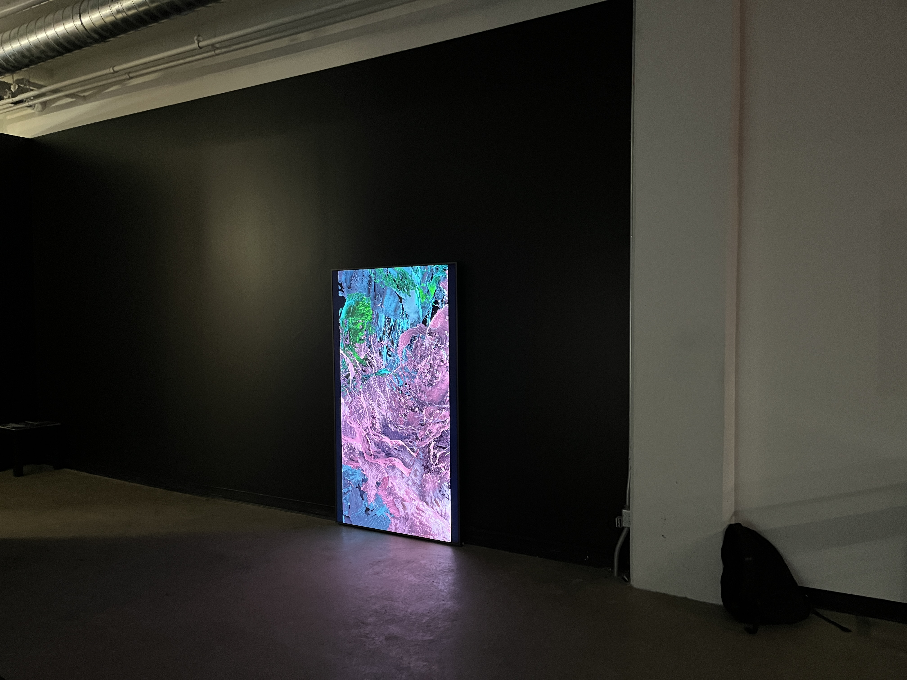|

***
### Composantes et techniques
L'œuvre utilise simplement des écrans.
| Écran avec image rouge | Écran avec image bleu |
| :---: | :---: |
| 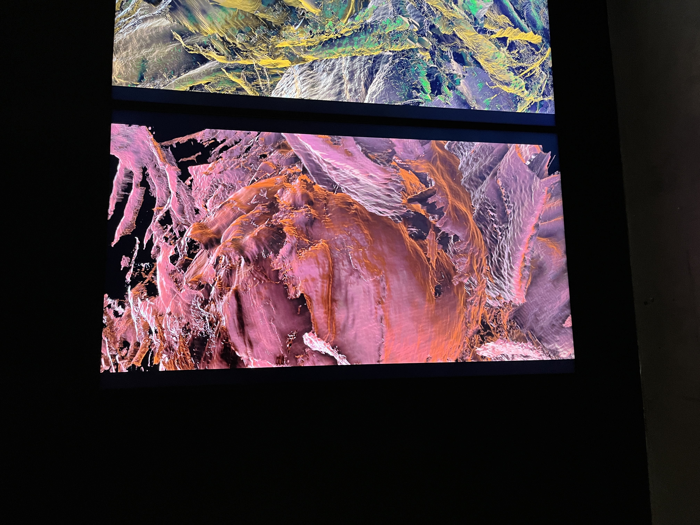 | 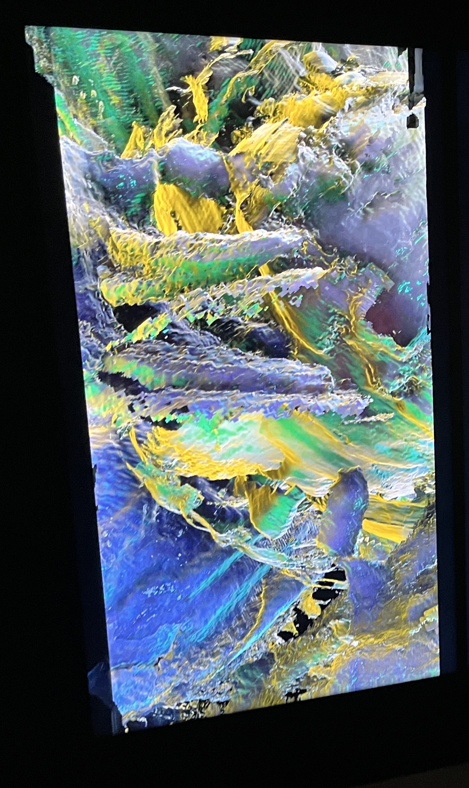 |

***
### Éléments nécessaires à la mise en exposition

  image

L'exposition nécessitait l'utilisation de supports muraux pour fixer les affichages au mur et des bancs pour que les visiteurs puissent s'asseoir et les admirer confortablement, surtout s'ils ne pouvaient pas rester debout pendant de longues périodes.

***
### Expérience vécue
C'était une expérience détendue où les visiteurs étaient libres de regarder, se promener ou s'asseoir selon leur préférence. Les visiteurs pouvaient regarder l'écran debout ou observer confortablement depuis un banc.
| Vue de l'expérience debout | Vue de l'expérience assise |
| :---: | :---: |
| 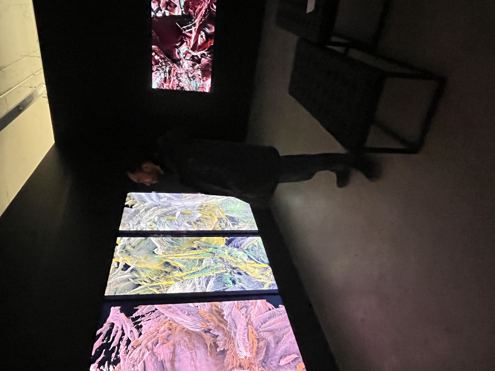 | 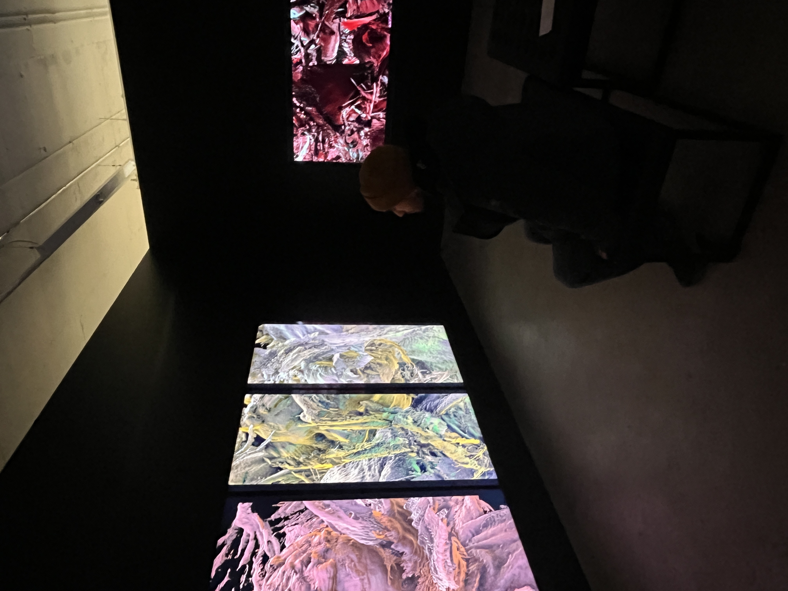 |

| Vidéo de l'expérience |
| :---: |
| [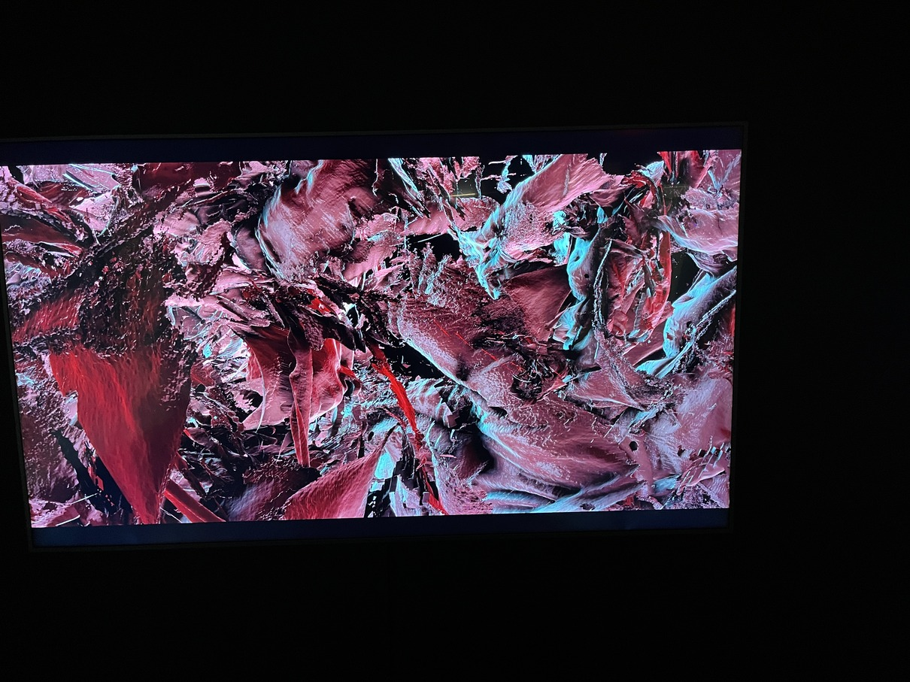](https://youtu.be/B8Mq9IGTpOg) |
| Cliquez sur l'image pour accéder à la vidéo YouTube. |

***
### Ce qui vous a plu, vous a donné des idées👍
J'ai beaucoup apprécié cette exposition pour sa simplicité. C'était une expérience qui nécessitait simplement vos yeux et votre cerveau, et j'ai trouvé intéressant comment l'œuvre pouvait facilement susciter la réflexion.

| Le visage de l'artiste dans l'oeuvre |
| :---: |
|  |

***
### Aspect que vous ne souhaiteriez pas retenir pour vos propres créations ou que vous feriez autrement👎
Malheureusement, j'ai trouvé que l'expérience était assez courte, car elle se composait de quelques écrans dans une petite pièce. Il était facile de faire le tour en moins d'une demi-heure.

***
### Autres photos et vidéos de l'expérience.
|  Écran avec image mauve | Écran avec image vert |
| :---: | :---: |
| 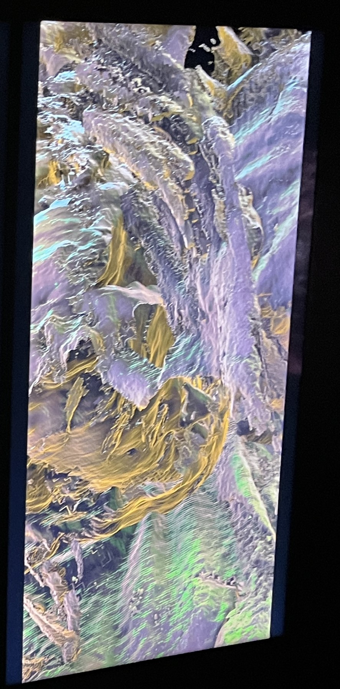  https://www.youtube.com/watch?v=kCapbv7id2s  | 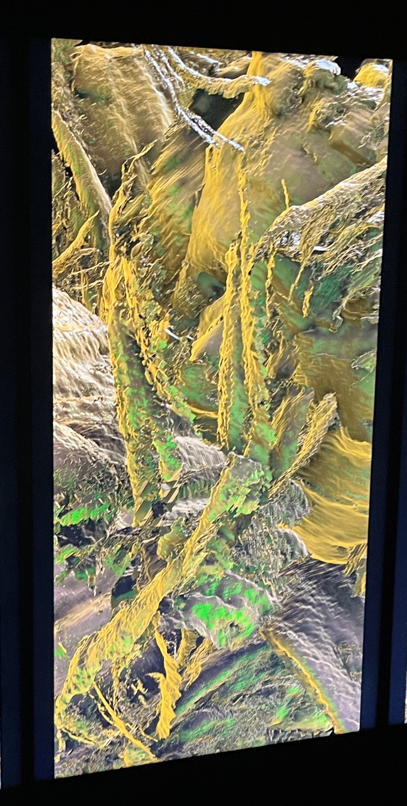 |
| Écran verticale | Vue de trois écrans |
| 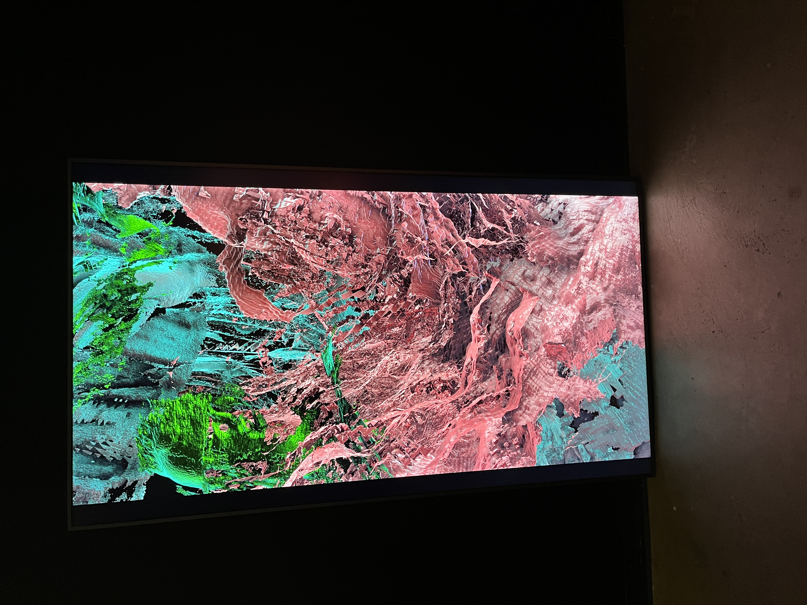 | 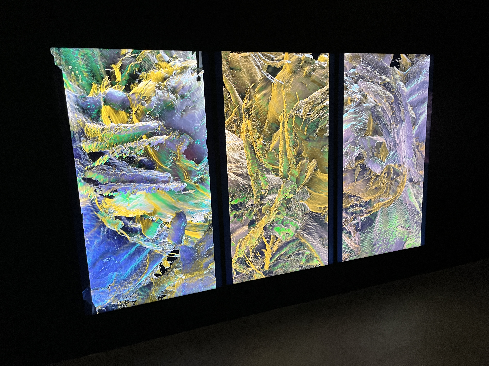  https://youtu.be/a-UZnRUcuZg  |
